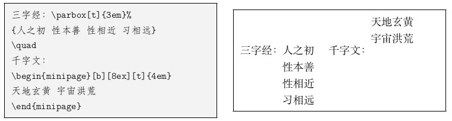

# 基本概念

## LATEX命令和代码结构
### LATEX命令和环境

- 反斜线和后面的一串字母，如 `\LaTeX`。它们以任意非字母符号（空格、数字、标点等）为界限
- 反斜线和后面的单个非字母符号，如`\$`
- LATEX命令是大小写敏感的
- 参数
  * LATEX参数分为`可选参数`和`必选参数`
  * 可选参数以[]包裹
  * 必选参数以{}包裹
  * 还有些带`*`的参数，可以先理解为一种特殊的可选参数
- 环境
  * 用以令一些效果在局部生效，或是生成特殊的文档元素，语法为一对`\begin`和`\end`命令
    ```latex
    \begin{⟨environment name⟩}[⟨optional arguments⟩]{⟨mandatory arguments⟩}
    …
    \end{⟨environment name⟩}
    ```
### LATEX源代码结构
- LATEX源码以一个`\documentclass`命令作为开头
- 在`\documentclass`和`\begin{document}`之间的位置称为导言区。在导言区中一般会使用
```latex
\documentclass{...}
% ... 为某文档类
% 导言区
\begin{document}
% 正文内容
\end{document}
% 此后内容会被忽略
```
## LATEX宏包和文档类
- `\documentclass[⟨options⟩]{⟨class-name⟩}`
  * `class-name`为文档类的名称
    | class-name                | 文档                           |
    |---------------------------|--------------------------------|
    | article                   | 文章格式的文档类               |
    | report                    | 长篇报告格式的文档类           |
    | book                      | 书籍文档类                     |
    | proc                      | 基于articse文档类的学术文档模板 |
    | slides                    | 幻灯格式的文档类               |
    | minimal                   | 一个极简的文档类               |
    | ctextart/ctexbook/ctexrep | 支持中文排版                   |  |

  * 可选参数可以指定字号，纸张大小，单双面等
    + `\documentclass[11pt,twoside,a4paper]{article}`
  * LATEX的三个标准文档类可指定的选项：
    | args                                                          | 参数                        |
    |---------------------------------------------------------------|-----------------------------|
    | 10pt                                                          | 字号，默认10pt              |
    | a4paper/letterpaper/a5paper/b5paper/executivepaper/legalpaper | 纸张大小, 默认为letterpaper |
    | twoside/oneside                                               | 单页/双页排版               |
    | onecolumn/twocolumn                                           | 指定单/双栏                 |
    | openright/openany                                                          | 指定新的一章 \chapter 是在奇数页（右侧）开始，还是直接紧跟着上一页开始                        |
    | landscape                                                          | 指定横向排版，默认为纵向                        |
    | titlepage/notitlepage                                                          | 指定标题命令 \maketitle 是否生成单独的标题页                        |
    | flegn                                                          | 令行间公式左对齐，默认为居中对齐                        |
    | leqno                                                          | 将公式编号放在左边，默认为右边                        |
    | draft/final                                                          | 指定草稿/终稿模式, 默认为final                        |

### 宏包
- 在使用 L A TEX 时，时常需要依赖一些扩展来增强或补充 L A TEX 的功能，比如排版复杂的表格、插入图片、增加颜色甚至超链接等等。这些扩展称为宏包。 
- `\usepackage[⟨options⟩]{⟨package-name⟩}`
- `texdoc ⟨pkg-name⟩`可以查询对应文档

### 文件的组织方式
- 当内容较多时，通常将源文件分割成若干个文件，然后再在主文件中引入
- `include{filename}`在源代码中插入文件
  * 如果和要编译的主文件不在同一目录，则要加上相对或绝对路径
    + `\include{chapters/a.tex} %` 相对路径
    + `\include{/home/chapters/a.tex} % *nix` 包含Linux、macOS(OSX)相对路径
    + `\include{D:/chapters/a.tex} % Windows` 相对路径
  * filename也可以不带扩展名，默认扩展名为`.tex`
- `\input{filename}`
  * `\include`在引入时会另起一篇，有时候不需要这样，则使用`\input{filename}`
- `\includeonly{filename1, filename2, ...}`
  * 用于导言区，指定只载入某些文件, 正文中不在该列表范围的`\include`命令不会起效
- `\syntexonly`使LATEX编译后不生成PDF或者DVI，只排查错误

  ```latex
  \usepackage{syntonly}
  \syntexonly
  ```
# 排版

## 排版中文
- `ctex`宏包用于各类文档类排版中文
  ```latex
  \documentclass{ctexart}
  \begin{document}
  在\LaTeX{}中排版中文。
  汉字和English单词混排，通常不需要在中英文之间添加额外的空格。
  当然，为了代码的可读性，加上汉字和 English 之间的空格也无妨。
  汉字换行时不会引入多余的空格。
  \end{document}
  ```
## 字符
### 空格和分段
- LATEX 源代码中，空格和Tab 输入的空白字符视为“空格”。连续的若干个空白字符视为一个空格。一行开头的空格忽略不计。
- 行末的换行符视为一个空格；但连续两个换行符，也就是空行，会将文字分段。多个空行被视为一个空行；
- 也可以使用`\par`命令分段

### 注释
- `%`

### 特殊字符
- LATEX中也有特殊字符，想要输入特殊字符则使用`\`转义符号转义
- `\\`被直接定义成了手动换行的命令，输入反斜线就需要用`\textbackslash`

### 连字
- 西文排版经常会出现连字，常见的有ff/fi/fl/ffi/ffl

### 标点符号
- 中文的标点符号（绝大多数为非 ASCII 字符）使用中文输入法输入即可，一般不需要过多留意，但输入西文标点符号时，也有需要注意的
- 引号
  * 单引号`''`分别用\`和`'`输入
  * 双引号`""`分别用\`\`和`"`输入
- 连字号和破折号
  | 符号  | 表示     |
  |-------|----------|
  | `-`   | 连字号   |
  | `--`  | 短破折号 |
  | `---` | 长破折号 |
- 省略号`\ldots`, `\dots`

### 断行和断页
- 断行
  * `\\[length]`
    + 带可选参数，用于断行处向下增加垂直间距
    + 也在表格、公式等地方用户换行
  * `\newline`
    + 仅用于文本段落
- 断页
  * `\newpage`
  * `\clearpage`
  * 在双栏排版模式中`\newpage`另起一栏，而`\clearpage`还是另起一页

- `\linebreak`, `\nolinebreak`, `\pagebreak`, `\nopagebreak`

### 断词
- 如果LATEX 遇到了很长的英文单词，仅在单词之间的“空格”处断行无法生成疏密程度匀称的段落时，就会考虑从单词中间断开。对于绝大多数单词，LATEX 能够找到合适的断词位置，在断开的行尾加上连字符`-`。
- 如果一些单词没能自动断词，我们可以在单词内手动使用`\-`命令指定断词的位置


# 文档元素

## 章节和目录

### 章节标题
- `\chapter{title}`
  * 只在book和report文档类有定义
- `\section{title}`
- `\subsection{title}`
- `\subsubsection{title}`
- `\paragraph{title}`
- `\subparagraph{title}`
- 上述命令都自动生成带编号的标题，并在目录中添加条目，影响页眉页脚的内容
- 每个命令都有两种变体
  * 带可选参数的`\section[short title]{title}`
    + 标题使用`title`, 目录、页眉和页脚是使用`short title`参数
  * 带星号的`\section*{title}`
    + 标题不带编号，也不生成目录项和页眉页脚
- 较低层次如`\paragraph`和`\subparagraph`即使不用带星号的变体，生成的标题默认也不带编号

- article文档类带编号层级为`\section`、`subsection`、`subsubsection`三级
- report/book文档类带编号层级为`chapter`、`\section`、`subsection`三级

### 目录
- `\tableofcontents`
- `\addcontentsline{toc}{level}{title}`

### 文档结构的划分
- 所有标准文档类都提供了一个`\appendix`命令将正文和附录分开，使用`\appendix`后，最高一级章节改为使用拉丁字母编号，从A 开始。
- book文档类还提供了前言、正文、后记结构的划分命令：
  * `\frontmatter`前言部分，页码为小写罗马字母格式；其后的 \chapter 不编号。
  * `\mainmatter`正文部分，页码为阿拉伯数字格式，从 1 开始计数；其后的章节编号正常。
  * `\backmatter` 后记部分，页码格式不变，继续正常计数；其后的 \chapter 不编号。
以上三个命令还可和 \appendix 命令结合，生成有前言、正文、附录、后记四部分的文档

## 标题页
- `\title{title}`、`\author{author}`、`\date{date}`
- 在`\title`、`\author`等命令内可以使用`\thanks`命令生成标题页的脚注，用`\and`隔开多个人名。
- 信息给定后使用`\maketitle`生成标题页

## 交叉引用
- 定义标签`\label{label name}`
- 引用`\ref{label name}`或`\pageref{label name}`
- 定义label的位置
  | 类型     | 位置                                                           |
  |----------|----------------------------------------------------------------|
  | 章节标题 | `\section`之后紧接着使用                                       |
  | 行间公式 | 单行公式在公示内任意位置使用，多行共识在每一行公式任意位置使用 |
  | 有序列表 | 在`enumerate`环境的每个`\item`之后、下一个`item`之前使用       |
  | 图表标题 | 在图表标题命令`\caption`之后紧接着使用                         |
  | 定理环境 | 在定理环境内部任意位置使用                                     |

## 脚注
- `\footnote{footnote}`
  ```latex
  "to be or not to be."\footnote{from Shakespeare}
  ```
- 但如上使用可能会出现不能正确生成脚注的问题，然后可以分两步进行:
  * 有使用`\footnotemark`为脚注计数再使用`\footnotetext`生成脚注
    ```latex
    \begin{tabular}{l}
    \hline
    "to be or not to be."\footnotemark \\
    \hline
    \end{tabular}
    \footnotetext{from Shakespeare}
    ```
- `\marginpar[left-margin]{right-margin}`可在边栏生成边注
  * 如果只给定了⟨right-margin⟩，那么边注在奇偶数页文字相同；
  * 如果同时给定了⟨left-margin⟩，则偶数页使用⟨left-margin⟩的文字

## 特殊环境
### 列表
- 有序列表`enumerate`
  ```latex
  \begin{enumerate}
  \item ...
  \end{enumerate}
  ```
- 无序列表`itemize`
  ```latex
  \begin{itemize}
  \item ...
  \end{itemize}
  ```
- 其中`\item[icon]`可带一个可选参数，将有序列表的计数或者无序列表的符号替换成自定义符号
- 列表可以嵌套使用，最多嵌套四层
- `description`
  * 用法与上面相似，**只不过`\item`后的可选参数用来写关键字，以粗体显示，一般是必填**
- `\labelitemi`~`\labelitemiv`
  * 定义无序列表的符号
    ```latex
    \renewcommand{\labelitemi}{\ddag}
    \renewcommand{\labelitemii}{\dag}
    ```
- `\labelenumi`~`\labelenumiv`
  * 定义有序列表的符号
  * 重新定义这些命令需要用到计数器相关命令

### 对齐环境
| command    | meaning |
|------------|---------|
| center     | 居中    |
| flushleft  | 左对齐  |
| flushright | 右对齐  |
- 用法
  ```latex
  \begin{center} … \end{center}
  \begin{flushleft} … \end{flushleft}
  \begin{flushright} … \end{flushright}
  ```
| command      | meaning |
|--------------|---------|
| \centering   | 居中    |
| \raggedleft  | 左对齐  |
| \raggedright | 右对齐  |
- 用法
  ```latex
  \centering
  this is center.
  \raggedleft
  this is left.
  \raggedright
  this is right.
  ```
- `center`等环境会在上下文产生一个额外间距，而`\centering`等命令不产生，只是改变对齐方式。比如在浮动体环境table或figure 内实现居中对齐，用`\centering`命令即可，没必要再用`center`环境。

### 引用环境
- `quote`用于引用较短文字，首行不缩进
- `quotation`用于引用若干文字，首行缩进
- **引用环境较一般文字有额外的缩进**
- `verse`用于排版诗歌，与`quotation`恰好相反，`verse`是首行悬挂缩进的

### 摘要环境
- 摘要环境 abstract 默认只在标准文档类中的 article 和 report 文档类可用，一般用于紧跟maketitle 命令之后介绍文档的摘要。
- 如果文档类指定了 titlepage 选项，则单独成页；
- 反之，单栏排版时相当于一个居中的小标题加一个 quotation 环境，双栏排版时相当于 \section\* 定义的一节

### 代码环境
- `\verbatim`, 将代码原样转义输出
  ```latex
  \begin{verbatim}
  #include <iostream>
  int main()
  {
    std::cout << "Hello, world!"
    return 0
  }
  \end{verbatim}
  ```
- `\verabtim*`将进一步显示空格
- `\verb`排版简短的代码或关键字
  ```latex
  \verb|\LaTeX|  -> \LaTeX
  ```
- `verbatim`宏包
  * 提供了`verbatiminput`命令来直接读取文件生成代码环境
- `listings`宏包可生成关键字高亮的代码环境，支持各种程序设计语言的语法和关键字

### 表格
- `tabular`
  ```latex
  \begin{tabular}[⟨align⟩]{⟨column-spec⟩}
  ⟨item1⟩ & ⟨item2⟩ & … \\
  \hline
  ⟨item1⟩ & ⟨item2⟩ & … \\
  \end{tabular}
  ```
  * `column-spec`是列格式标记
  * `&`用来分隔单元格
  * `\\`用来换行
  * `\hline`用来在行与行之间绘制横线
- 直接使用`tabular`环境会和周围文字混排，上面的`align`是个可选参数，控制垂直对齐
  * `t`表示顶部
  * `b`表示底部
  * 其他参数或不写表示居中对齐

### 列格式
- 使用`column-spec`参数指定表格列数以及每列格式
  | 列格式    | 说明                                 |
  |-----------|--------------------------------------|
  | l/c/r     | 单元格内容左对齐/居中/右对齐, 不折行 |
  | p{width}  | 单元格宽度固定为width，可自动折行    |
  | \|        | 绘制竖线                             |
  | @{string} | 自定义内容string                     |

```latex
\begin{tabular}{lcr|p{6em}}
  \hline
  left & center & right & par box with fixed width\\
  L    & C      & R     & P \\
  \hline
\end{tabular}
```

- 表格每行的单元格数目不能多于列格式里`l/c/r/p`的总数(可以少于这个总数)，否则出错
- `@`格式可在单元格前后插入任意文本，但他也同时消除了单元格前后额外添加的间距
```latex
\begin{tabular}{@{} rA{:}lr @{}}
  \hline
  1   & 1 & one \\
  11  & 3 & eleven \\
  \hline
\end{tabular}
```

- LATEX 还提供了简便的将格式参数重复的写法 \*{⟨n⟩}{⟨column-spec⟩}
  * 下面两条命令是等效的
    ```latex
    \begin{tabular}{|c|c|c|c|c|p{4em}|p{4em}|}
    \begin{tabular}{|*{5}{c|}*{2}{p{4em}|}|}
    ```
- 修饰整列字体, `array`宏包提供了辅助格式`>`和`<`用于给列格式前后加上修饰命令
  ```latex
  \begin{tabular}{>{\itshape}r<{*}l} 
    \hline
    italic & normal \\
    column & column \\
    \hline
  \end{tabular}
  ```

  * 辅助格式甚至支持插入`\centering`等命令改变 p 列格式的对齐方式，一般还要加额外的命令`\arraybackslash`以免出错(前面的命令会破坏表格环境中的`\\`，所以用后面的命令恢复)
  ```latex
  \begin{tabular}
  {>{\centering\arraybackslash}p{9em}} 
    \hline
    Some center-aligned long text. \\
    \hline
  \end{tabular}
  ```

- array宏包该提供了类似`p`格式的`m`格式和`b`格式，三者分别在垂直防线上靠顶端对齐、居中、底端对齐
  ```latex
  \newcommand\txt
    {a b c d e f g h i}
  \begin{tabular}{cp{2em}m{2em}b{2em}}
    \hline
    pos & \txt & \txt & \txt \\
    \hline
  \end{tabular}
  ```


### 列宽
TODO

## 图片
```latex
\usepackage{graphicx}
\includegraphics[options]{filename}
```
- `filename`为图片文件名，与`\include`命令用法类似，需要用相对路径或绝对路径
- 图片的扩展名可以不用写
- 注意文件名中不要有空格，也不要有多于的英文点号
- `\graphicspath`用于声明一个或多个图片文件存放的目录，使用这些目录的图片时可不用写路径
  * `\graphicspath{{figures/}{logo/}}`假设主要图片放在figures子目录下，标志放在logo子目录下
- `\includegraphics[options]{filename}`中的`options`
  | 参数            | 含义                        |
  |-----------------|-----------------------------|
  | width=⟨width⟩   | 将图片所放在宽度为width     |
  | height=⟨height⟩ | 将图片所放在高度为height    |
  | scale=⟨scale⟩   | 将图片相对与原尺寸缩放scale |
  | angle=⟨angle⟩   | 令图片逆时针旋转angle度     |

## 盒子
### 水平盒子
```latex
\mbox{...}
\makebox[width][align]{...}
```
- `\mbox`生成一个基本的水平盒子，内容只有一行，不允许分段(除非嵌套其他盒子, 比如下面说到的垂直盒子)
- \makebox 更进一步，可以加上可选参数用于控制盒子的宽度 ⟨width⟩，以及内容的对齐方式⟨align⟩，可选居中c（默认值）、左对齐l、右对齐r和分散对齐s 。


### 带框的水平盒子
```latex
# 两种方式
\fbox{...}
\framebox[width][align]{...}
```

- 可通过`\setlength`命令调节边框宽度`\fboxrule`和内边距`\fboxsep`


### 垂直盒子
```latex
# 两种方式
\parbox[⟨align⟩][⟨height⟩][⟨inner-align⟩]{⟨width⟩}{…}
\begin{minipage}[⟨align⟩][⟨height⟩][⟨inner-align⟩]{⟨width⟩}
…
\end{minipage}
```
- `align`位盒子和周围文字的对齐情况(类似tabular)
- `height`和`inner-align`(t、b、c、s)设置盒子的高度和内容对齐方式

- 如果在 minipage 里使用 \footnote 命令，生成的脚注会出现在盒子底部，编号是独立的，并且使用小写字母编号
- `\parbox`里无法正常使用`\footnote`命令，只能在盒子里使用`footnotemark`，在盒子外使用`\footnotetext`


### 标尺盒子
- `\rule`命令用来画一个实心的矩形盒子，也可以适当调整以用来画线(标尺)：
  ```latex
  \rule[raise]{width}{height}
  ```


## 浮动体
- 内容丰富的文章或者书籍往往包含许多图片和表格等内容。这些内容的尺寸往往太大，导致分页困难。LATEX 为此引入了浮动体的机制，令大块的内容可以脱离上下文，放置在合适的位置。
- LATEX预定义了两类浮动体环境`figure`和`table`，习惯上`figure`里放图片，`table`放表格，但并没有严格限制，可以在任何一个浮动体里放置文字、公式、表格、图片等等任意内容
- `table`用法(`figure`同理)
  ```latex
  \begin{table}[placement]
  ...
  \end{table}
  ```
  | placemant参数 | 含义                 |
  |---------------|----------------------|
  | h             | 当前位置             |
  | t             | 顶部                 |
  | b             | 底部                 |
  | p             | 单独成页             |
  | !             | 在决定位置时忽视限制 |
  * 默认设置为`tbp`，即允许浮动体排版在当前位置、底部或者单独成页
  * 排版位置的选取与参数里符号的顺序无关，LATEX 总是以h-t-b-p 的优先级顺序决定浮动体位置，也就是说 [!htp] 和 [ph!t] 没有区别。
  * 限制包括浮动体个数（除单独成页外，默认每页不超过 3 个浮动体，其中顶部不超过 2 个，底部不超过 1 个）以及浮动体空间占页面的百分比（默认顶部不超过 70%，底部不超过 30%）

- 双栏排版下，使用`table*`与`figure*`来排版跨栏的浮动体，用法与上面的一样，只不过只有`t`、`p`两个位置参数可用

- `float`宏包为浮动体提供了`H`位置参数, 该番薯不能与其他htbp!参数混用，使用 H 位置参数时，会取消浮动机制，将浮动体视为一般的盒子插入当前位置

### 浮动体标题
- 用法类似与`\section`等命令
- `\caption{...}`添加标题，并自动给浮动体编号
- `\caption*{...}`生成不带编号的标题
- `\caption[...]{...}`使得在目录中使用短标题
  * 可通过修改`\figurename`与`\tablename`来修改标题前缀
  * 可通过`\listoftables`与`\listoffigures`生成目录

### 并排和子图表
```latex
\begin{figure}[htbp]
  \centering
  \begin{minipage}{...}
    \centering
    \includegraphics[width=...]{...}
    \caption{...}
  \end{minipage}
  \qquad
  \begin{minipage}{...}
    \centering
    \includegraphics[width...]{...}
    \caption{...}
  \end{minipage}
\end{figure}
```


```latex
\begin{figure}[htbp]
  \centering
  \subfloat[...]{\label{sub-fig-1}%
    \begin{minipage}{...}
      \centering
      \includegraphics[width=...]{...}
    \end{minipage}
  }
  \qquad
  \subfloat[...]{%
    \begin{minipage}{...}
      \centering
      \includegraphics[width=...]{...}
    \end{minipage}
  }
  \caption{...}
\end{figure}
```


# 排版数学公式
- `\usepackage{amsmath}`

## 公式排版基础
### 行内和行间公式
- 行内公式由一对`$`符号包裹
```latex
This is a equ: $a^2 + b^2 = c^2$
```
- `equation`单独成行的公式，并生成一个编号
  * 这个编号可以用`\label`和`\ref`交叉引用，amsmath中的`\eqref`命令沈志伟引用自动加上圆括号
  * `\tag`可以手动修改公式编号，`\notag`取消为公式编号
  ```latex
  \begin{equation}
  a^2 + b^2 = c^2 \label{equ}
  \end{equation}
  Equation \eqref{equ} is called `Gougu theorem` in Chinese.
  ```
- 如果使用不带编号的行间公式，则用`\[`和`\]`包裹
  * 与之等效的是`equation*`和`displaymath`

### 数学模式
- 当用户使用 `$` 开启行内公式输入，或是使用 `\[` 命令、`equation` 环境时，LATEX 就进入了数学模式，数学模式相比文本模式有以下特点：
  * 数学模式中输入的空格被忽略。数学符号的间距默认由符号的性质（关系符号、运算符等）决定。需要人为引入间距时，使用 `\quad` 和 `\qquad` 等命令。
  * **不允许有空行**, 行间也无法用`\\`命令手动换行
  * 所有的字母被当作数学公式中的变量处理，字母间距与文本模式不一致，也无法生成单词之间的空格。
    + 如果想在数学公式中输入正体的文本，可用`\mathrm`或者`\text`命令
    

## 数学符号
### 一般符号
- `\alpha`、`\beta`、`\Gamma`、`\Delta`、`\infty`等等
- `^`上标，`_`下标, 上下标后面的内容一般需要用花括号`{}`包裹
- `'`为导数符号
- `\frac{分子}/{分母}`来表示分式
  * 分式的大小在行间公式中是正常大小，而在行内被极度压缩
  * `\dfrac`和`tfrac`能够在行内使用正常大小分式，或是反过来
  * `\binom`可以用来生成特殊的分式形式, 如二项式结构
- 关系符
  * LATEX可以直接输入`=`, `>`, `<`
  * `\ne`不等号，`\ge`大于等于，`\le`小于等于，`\approx`约等于
  * `\equiv`等价, `\propto`正比, `\sim`相似


