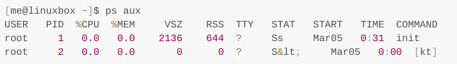
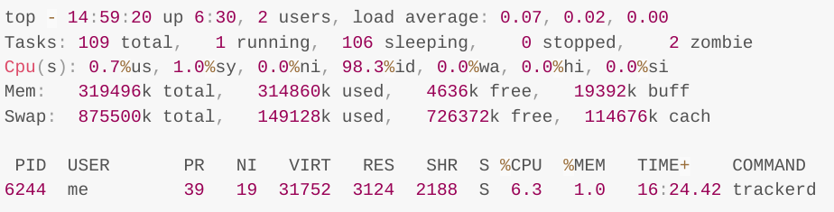
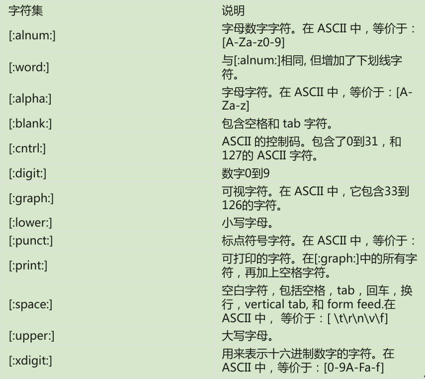

* [权限](#权限)
  - [更改用户](#更改用户)
  - [更改文件所有者和用户组](#更改文件所有者和用户组)
  - [更改用户密码](#更改用户密码)
* [进程](#进程)
  - [ps](#ps)
  - [top](#top)
  - [控制进程](#控制进程)
    + [kill命令给进程发送信号](#kill命令给进程发送信号)
    + [killall](#killall)
  - [其他进程相关命令](#其他进程相关命令)
* [shell环境](#shell环境)
  - [查看环境变量](#查看环境变量)
  - [一些shell变量介绍](#一些shell变量介绍)
  - [shell环境](#shell环境-1)
* [定制shell提示符](#定制shell提示符)
* [正则表达式](#正则表达式)
  - [grep](#grep)
  - [正则表达式元字符](#正则表达式元字符)
  - [POSIX字符集](#posix字符集)
  - [regular website](#regular-website)
* [文本处理](#文本处理)
  - [cat](#cat)
  - [sort](#sort)
  - [uniq](#uniq)
  - [cut](#cut)
  - [paste](#paste)
  - [join](#join)
  - [comm](#comm)
  - [diff](#diff)
  - [patch](#patch)
  - [tr](#tr)
  - [sed](#sed)
  - [aspell](#aspell)
* [格式化输出](#格式化输出)
  - [nl](#nl)
  - [fold](#fold)
  - [fmt](#fmt)
* [查找文件](#查找文件)
  - [locate](#locate)
  - [find](#find)
    + [find的测试条件](#find的测试条件)
    + [操作符](#操作符)
    + [预定义的操作](#预定义的操作)
    + [用户定义的操作](#用户定义的操作)
    + [命令选项](#命令选项)
    + [example](#example)
  - [xargs](#xargs)
* [编写shell脚本](#编写shell脚本)

## 权限
chmod

unmask

### 更改用户
```shell
su [-[l]] [user]
```
-l选项会为指定用户启动一个需要登陆的shell，加载该用户的shell环境，并且
工作目录会更改到这个用户的家目录;

如果不指定目录就假定是root，"-l"选项可以缩写为"-";
```shell
# 退出
exit
```

```shell
# 只执行单个命令不启动一个新的shell
su -c 'command'

# 查看sudo命令可以授予哪些权限
sudo -l
```


### 更改文件所有者和用户组
```shell
chown [owner][:[group]] file ...

# 把文件所有者从当前属主更改为用户laughing
chown laughing file
# 把文件所有者改为用户laughing,文件用户组改为用户组 users。
chown laughing:users file
# 把文件用户组改为用户组users, 文件所有者不变
chown :users file
# 文件所有者改为用户laughing,文件用户组改为,用户laughing登录系统时,所属的用户组
chown laughing: file
```

### 更改用户密码
```shell
passwd [user]
```

## 进程
- ps – 报告当前进程快照
- top – 显示任务
- jobs – 列出活跃的任务
- bg – 把一个任务放到后台执行
- fg – 把一个任务放到前台执行
- kill – 给一个进程发送信号
- killall – 杀死指定名字的进程
- shutdown – 关机或重启系统

### ps

```shell
[me@linuxbox ~]$ ps
PID TTY       TIME CMD
5198 pts/1    00:00:00 bash
10129 pts/1   00:00:00 ps
```

```shell
# ps x展示所有进程
[me@linuxbox ~]$ ps x
PID TTY STAT       TIME CMD
2799 ?  Ssl        0:00 /usr/libexec/bonobo-activation-server –ac
2820 ?  Sl         0:01 /usr/libexec/evolution-data-server-1.10 --
```
STAT：state表示进程状态
| 状态 | 意义                                 |
|------|--------------------------------------|
| R    | 运行                                 |
| S    | 睡眠                                 |
| D    | 不可中断睡眠                         |
| T    | 已停止                               |
| Z    | 僵尸进程                             |
| <    | 高级优先级进程，可能会赋予更多的资源 |
| N    | 低优先级进程                         |


```shell
ps aux
```
 
 

### top
 

| 行号          | 字段                                                     | 意义                             |
|---------------|----------------------------------------------------------|----------------------------------|
| 1             | top                                                      | 程序名                           |
| 14:59:20      | 当前时间                                                 |                                  |
| up 6:30       | 计算机从上次启动的运行时间                               |                                  |
| 2 users       | 有两个用户登录系统                                       |                                  |
| load average: | 等待运行的进程数量,三个值分别表示1min,5min,15min的平均值 |                                  |
| 2             | Tasks                                                    | 总结了进程数目和各种进程状态     |
| 3             | Cpu(s):                                                  | 描述CPU正在执行的进程特性        |
| 0.7%us        | CPU使用率                                                |                                  |
| 1.0%sy        | 1.0%的cpu时间被用于系统(内核)进程                        |                                  |
| 0.0%ni        | 于"nice"(低优先级)进程                                   |                                  |
| 98.3%id       | 98.3%的CPU时间是空闲的                                   |                                  |
| 0.0%wa        | 0.0%的CPU时间来等待I/O                                   |                                  |
| 4             | Mem:                                                     | 展示物理内存使用情况             |
| 5             | Swap:                                                    | 展示交换分区(虚拟内存)的使用情况 |

### 控制进程

```shell
# 后台运行command命令, 但是当前终端不能关闭
test.sh &

# 查看后台进程
jobs
```
output:
```shell
[1]+ Running    test.sh &
```

```shell
# 让一个进程返回前台执行
# Ctrl+z可以停止进程
fg %1

# 恢复后台运行
bg %1
```

#### kill命令给进程发送信号
这个 kill 命令不是确切地“杀死”程序,而是给程序 发送信号。信号是操作系统与程序之间进行通信,所采用的几种方式中的一种.
Ctrl-c会发送一个叫做INT(中断)的信号,Ctrl-z会发送一个叫做TSTP(终端停止)的信号；

```shell
kill [-signal] PID
```
当没有指定signal的时候，会发送TERM(终止)信号.
| 编号 | 名字 | 含义                                                                                             |
|------|------|--------------------------------------------------------------------------------------------------|
| 1    | HUP  | <++>                                                                                             |
| 2    | INT  | 中断，与ctrl-c一样，终止程序                                                                     |
| 9    | KILL | 杀死，内核立即终止这个进程, 它没有机会去做些“清理”工作,或者是保存劳动成果。                     |
| 15   | TERM | 终止，这是 kill 命令发送的默认信号。如果程序仍然“活着”,可以接受信号,那么这个信号终止            |
| 18   | CONT | 继续，停止一段时间后，进程恢复运行                                                               |
| 19   | STOP | 停止， 这个信号导致进程停止运行,而没有终止。像 KILL 信号,它不被 发送到目标进程,因此它不能被忽略 |

系统常使用的信号
| 编号 | 名字  | 含义                 |
|------|-------|----------------------|
| 3    | QUIT  | 退出                 |
| 11   | SEGV  | 段错误               |
| 20   | TSTP  | 终端停止，就像ctrl-z |
| 28   | WINCH | 改变窗口大小         |

```shell
# 查看完成信号列表
kill -l
```
#### killall
```shell
# 通过 killall 命令,给匹配特定程序或用户名的多个进程发送信号
killall [-u user] [-singal] name
```
```shell
[me@linuxbox ~]$ xlogo &
[1] 18801
[me@linuxbox ~]$ xlogo &
[2] 18802
[me@linuxbox ~]$ killall xlogo
[1]- Terminated   xlogo
[2]+ Terminated   xlogo
```

### 其他进程相关命令

| 命令名 | 描述                                                                                                                                                                  |
|--------|-----------------------------------------------------------------------------------------------------------------------------------------------------------------------|
| pstree | 输出一个树型结构的进程列表,这个列表展示了进程间父/子关系                                                                                                              |
| vmstat | 输出一个系统资源使用快照,包括内存,交换分区和磁盘 I/O。 为了看到连续的显示结果,则在命令名后加上延时的时间(以秒为单位)。例如,“vmstat 5”。 终止输出,按下 Ctrl-c 组合键 |
| xload  | 一个图形界面程序，可以画出系统负载的图形                                                                                                                              |
| tload  | 与 xload 程序相似,但是在终端中画出图形                                                                                                                                |

## shell环境
shell 在环境中存储了两种基本类型的数据,虽然对于 bash 来说,很大程度上这些类型是不可 辨别的。
它们是环境变量和 shell 变量。Shell 变量是由 bash 存放的少量数据,而剩下的基本上都是环境变量。
除了变量,shell 也存储了一些可编程的数据,命名为别名和 shell 函数。

### 查看环境变量
```shell
# 查看全部环境变量
printenv | less

# 查看指定变量
printenv USER

# printenv仅显示环境变量，set会显示环境变量和shell变量
set | less

# echo显示变量
echo $HOME
echo $PATH
```

如果 shell 环境中的一个成员既不可用 set 命令也不可用 printenv 命令显示,则这个变量是别名。 输入不带参数的 alias 命令来查看它们:
```shell
alias
```

### 一些shell变量介绍
| 变量    | 内容                                                             |
|---------|------------------------------------------------------------------|
| DISPLAY | 显示器名字，通常为":0"                                           |
| EDITOR  | 文本编辑器的名字                                                 |
| SHELL   | shell程序的名字                                                  |
| HOME    | 家用户目录                                                       |
| LANG    | 定义字符集以及语言编码方式                                       |
| OLD_PWD | 先前的工作目录                                                   |
| PAGER   | 页输出程序的名字，通常设置为/usr/bin/less                        |
| PATH    | 由冒号分开的目录列表,当你输入可执行程序名后,会搜索这个目录列表。 |
| PS1     | 定义了shell提示符的内容                                          |
| PWD     | 当前工作目录                                                     |
| TERM    | 终端类型名,该变量设置终端模拟器所用的协议                        |
| TZ      | 指定你所在的时区                                                 |
| USER    | 用户名                                                           |

### shell环境
当我们登录系统后,启动 bash 程序,并且会读取一系列称为启动文件的配置脚本, 这些文件定义了默认的可供所有用户共享的 shell 环境。
然后是读取更多位于我们自己家目录中 的启动文件,这些启动文件定义了用户个人的 shell 环境。
精确的启动顺序依赖于要运行的 shell 会话 类型。有两种 shell 会话类型:一个是登录 shell 会话,另一个是非登录 shell 会话。
- 登录shell会话会提示用户输入用户名和密码;
- 当在GUI模式下运行终端会话时,非登录shell会话会出现;

**登陆shell会话的启动文件**
| 文件            | 内容                                                       |
|-----------------|------------------------------------------------------------|
| /etc/profile    | 应用与所有用户的全局配置脚本                               |
| ~/.bash_profile | 用户私人的启动文件，可以用来扩展或重写全局配置脚本中的设置 |
| ~/.bash_login   | 如果~/.bash_profile没找到，bash会尝试读取这个脚本          |
| ~/.profile      | 如果上面两个文件都没找到，bash会尝试读取这个文件           |
**非登陆shell会话的启动文件**
| 文件             | 内容                                                       |
|------------------|------------------------------------------------------------|
| /etc/bash.bashrc | 应用于所有用户的全局配置文件                               |
| ~/.bashrc        | 用户私有的启动文件，可以用来扩展或重写全局配置脚本中的设置 |

## 定制shell提示符
<++>


## 正则表达式

### grep
| options | options                                  |
|---------|------------------------------------------|
| -i      | 忽略大小写                               |
| -v      | 选取不包含匹配项的文本行                 |
| -c      | 打印匹配的数量                           |
| -l      | 打印包含匹配项的文件名                   |
| -L      | 打印不包含匹配项的文件名                 |
| -n      | 在每个匹配项前打印其位于文件中的相应行号 |
| -h      | 应用于多文件搜索,不输出文件名            |

### 正则表达式元字符
- `^` `$` `.` `[` `]` `{` `}` `-` `?` `*` `+` `(` `)` `|` `\`,
其它所有字符都被认为是原义字符,虽然在个别情况下,反斜杠会被用来创建元序列, 也允许元字符被转义为原义字符,而不是被解释为元字符。
- 任意字符`.`
  ```shell
  grep -h '.zip' dirlist*.txt
  ```
- 锚点`^`,`$`
  ```shell
  # 匹配以zip开头的项
  $ grep -h '^zip' dirlist*.txt
  zip
  zipcloak
  zipgrep
  zipinfo
  zipnote
  zipsplit

  # 匹配以zip结尾的项
  $ grep -h 'zip$' dirlist*.txt
  gunzip
  gzip
  funzip
  gpg-zip
  preunzip
  prezip
  unzip
  zip

  $ grep -h '^zip$' dirlist*.txt
  zip

  ```
- 锚点`^`,`$`与任意字符`.`
  ```shell
    $ grep -i '^..j.r$' /usr/share/dict/words
    Major
    major
  ```
- 中括号表达式和字符类`[]`
  ```shell
    $ grep -h '[bg]zip' dirlist*.txt
    bzip2
    bzip2recover
    gzip
  ```
  一个字符集合可能包含任意多个字符,并且元字符被放置到中括号里面后会失去了它们的特殊含义
  * 插入字符`^`表示否定
    ```shell
    # 得到除了“b”和“g”之外的任意字符
    # 且必须保证前面有字符，所以zip也没有匹配
    $ grep -h '[^bg]zip' dirlist*.txt
    bunzip2
    gunzip
    funzip
    gpg-zip
    preunzip
    prezip
    prezip-bin
    unzip
    unzipsfx
    ```
    如果在正则表示式中的第一个字符是一个插入字符,则剩余的字符被看作是不会在给定的字符位置出现的字符集合。
  * 传统字符`[A-Z]`,`[a-z]`,`[0-9]`
    ```shell
    # 找到所有以大写字母开头的
    $ grep -h '^[A-Z]' dirlist*.txt
    MAKEDEV
    ControlPanel
    GET
    HEAD
    POST
    
    # 匹配所有字母与数字开头的
    $ grep -h '^[A-Za-z0-9]' dirlist*.txt
    ```
    以上连字符`-`被特殊对待，如果需要匹配连字符`-`，则将其放在第一个
    ```shell
    # 匹配连字符`-`和大写字母A,Z
    $ grep -h '[-AZ]' dirlist*.txt
    ```
- 任意空白字符`\s`
- 任意非空白字符`\S`

### POSIX字符集

  传统的字符区域在处理快速地指定字符集合的问题方面,是一个易于理解的和有效的方式。
  但是依赖于不同的linux发行版，不同发行版的linux中ascii排序可能不同，就有可能[A-Z]并不只包含大写字母;
  

**POSIX 基本的 Vs.扩展的正则表达式**
* 基本正则表达式(BRE)和扩展的正则表达式(ERE)
* **BRE**可以辨别元字符`^` `$` `.` `[ ]` `*`,其他所有字符认为是文本字符
* **ERE**在BRE的基础上添加了`( )` `{ }` `?` `+` `|`
* 元字符与文本字符可通过反斜杠`\`转义
* 扩展表达式
  + `grep`需要加上`-E`之后可支持扩展表达式
  + 交替符 `|`
    ```shell
    $ echo "AAA" | grep -E 'AAA|BBB'
    AAA
    $ echo "BBB" | grep -E 'AAA|BBB'
    BBB

    # 匹配列表中以"bz","gz",或"zip"开头的文件名
    $ grep -Eh '^(bz|gz|zip)' dirlist*.txt

    # 匹配列表中以"bz"开头或包含"gz","zip"的文件名
    $ grep -Eh '^bz|gz|zip' dirlist*.txt
    ```
  + 限定符
    + `?`匹配0个或1个
    + `*`匹配任意个(包含0)
    + `+`匹配任意个(不包含0)
    + `{}`匹配特定个数
      | 限定符 | 含义                                           |
      |--------|------------------------------------------------|
      | {n}    | 匹配前面的元素，如果他确切的出现了n次          |
      | {n,m}  | 匹配前面的元素，如果他至少出现了n次但不多于m次 |
      | {n,}   | 匹配前面的元素，如果他出现了n次及以上          |
      | {,m}   | 匹配前面的元素，如果他出现的次数不多于m        |


### regular website
- [https://regexper.com/](https://regexper.com/) 
- [https://ihateregex.io/](https://ihateregex.io/) 

## 文本处理
| command | meaning                                |
|---------|----------------------------------------|
| cat     | 连接文件并且打印到标准输出             |
| sort    | 给文本行排序                           |
| uniq    | 报告或者省略重复行                     |
| cut     | 从每行中删除文本区域                   |
| paste   | 合并文件文本行                         |
| join    | 基于某个共享字段来联合两个文件的文本行 |
| comm    | 逐行比较两个有序的文件                 |
| diff    | 逐行比较文件                           |
| patch   | 给原始文件打补丁                       |
| tr      | 翻译或删除字符                         |
| sed     | 用于筛选和转换文本的流编辑器           |
| aspell  | 交互式拼写检查器                       |

### cat
```shell
# 显示所有字符
cat -A foo.txt

# 显示行号
cat -n foo.txt

# 去除多于的空白行
cat -s foo.txt
```
Tips: `cat`是正向打印输出，`tar`命令与cat相反，tar是反向打印输出
### sort
- sort 程序对标准输入的内容,或命令行中指定的一个或多个文件进行排序,然后把排序 结果发送到标准输出
- sort 程序能接受命令行中的多个文件作为参数,所以有可能把多个文件合并成一个有序的文件
- sort默认使用tab或者空格来作为分隔符

```shell
sort file1.txt file2.txt file3.txt > final_sorted_list.txt
```
默认情况下，sort对整行进行排序，从每一行的第一个字开始。
| 选项 | 长选项                  | 描述                                                                                         |
|------|-------------------------|----------------------------------------------------------------------------------------------|
| -b   | --ignore-leading-blanks | 这个选项使sort忽略开头的空格，从第一个非空白字符开始排序                                     |
| -f   | --ignore-case           | 让sort不区分大小写                                                                           |
| -n   | --numeric-sort          | 基于字符串长度来排序                                                                         |
| -r   | --reverse               | 按相反顺序排序，结果按照降序排列，而不是升序                                                 |
| -k   | --key=field1[,field2]   | 对field1到field2之间的字符排序，而不是整个文本行                                             |
| -m   | --merge                 | 把每个参数看作是一个预先排好序的文件，把多个文件合并成一个排好序的文件，而没有执行额外的排序 |
| -o   | --output=file           | 把排好序的输出结果发送到文件                                                                 |
| -t   | --field-separator=char  | 定义域分割字符，默认情况下，域由空格或制表符分割                                             |
| -u   | --                      | 从排好序的输出结果中删除重复行                                                               |
```shell
$ du -s /usr/share/* | sort -nr | head
509940 /usr/share/locale-langpack
242660 /usr/share/doc
197560 /usr/share/fonts
179144 /usr/share/gnome
146764 /usr/share/myspell
144304 /usr/share/gimp
135880 /usr/share/dict
76508 /usr/share/icons
68072 /usr/share/apps
62844 /usr/share/foomatic

# -k 5表示按照第5列排序
$ ls -l /usr/bin | sort -nr -k 5 | head
-rwxr-xr-x 1 root root 8234216 2008-04-0717:42 inkscape
-rwxr-xr-x 1 root root 8222692 2008-04-07 17:42 inkview
...
```
**sort允许多个-k选项的实例**
```shell
# 先按照第一个字段排序，再按照第二个字段排序
$ sort --key=1,1 --key=2n distros.txt
Fedora 5 03/20/2006
Fedora 6 10/24/2006
Fedora 7 05/31/2007
```
**sort允许在key选项中定义偏移**
```shell
# 按照下面的格式，年月日排序
$ sort -k 3,7nbr -k 3.1nbr -k 3.4nbr distros.txt
Fedora 10 11/25/2008
Ubuntu 8.10 10/30/2008
SUSE 11.0 06/19/2008
```

### uniq
- uniq 会删除任意重复行,并且把结果发送到标准输出
- uniq只会删除相邻的重复行, 所以通常与sort一起使用

| 选项 | 说明                                                          |
|------|---------------------------------------------------------------|
| -c   | 输出所有重复行，并且每行开头显示重复次数                      |
| -d   | 只输出重复行，而不是特有的文本行                              |
| -f n | 忽略开头的n个字段，字段之间由空格分割，正如sort中的空格分隔符 |
| -i   | 在比较文本行的时候忽略大小写                                  |
| -s n | 跳过每行开头n个字符                                           |
| -u   | 只是输出独有的文本行，这是默认的                                                          |
### cut
cut 程序被用来从文本行中抽取文本,并把其输出到标准输出。它能够接受多个文件参数或者 标准输入。

| 选项          | 说明                                                                                                     |
|---------------|----------------------------------------------------------------------------------------------------------|
| -c char_list  | 从文本行中抽取由char_list定义的**文本**,这个列表可能由一个或多个逗号分割开的数值区间组成                 |
| -f field_list | 从文本中抽取一个或多个由field_list定义的**字段**，这个列表可能包括一个或多个字段，或由逗号分隔开的字段区间 |
| -d delim_char | 当指定-f选项之后，使用delim_char作为字段分隔符，默认是tab                                                |
| --complement  | 抽取整个文本行，除了那些由-c和/或-f选项指定的文本                                                        |
```shell
# 提取由tab作为分隔符的第3个字段
$ cut -f 3 distros.txt
12/07/2006
11/25/2008
06/19/2008
04/24/2008

# 提取由tab作为分隔符的第3个字段中的第7到10个字符
$ cut -f 3 distros.txt | cut -c 7-10
2006
2008
2008
2008
```
### paste
paste 命令的功能正好与 cut 相反。它会添加一个或多个文本列到文件中,而不是从文件中抽取文本列。通过读取多个文件,然后把每个文件中的字段整合成单个文本流,输入到标准输出
```shell
$ head distros-versions.txt
Fedora 10
Ubuntu 8.10
SUSE 11.0
$ head distros-dates.txt
11/25/2008
10/30/2008
06/19/2008
$ paste distros-dates.txt distros-versions.txt
11/25/2008 Fedora 10
10/30/2008 Ubuntu 8.10
06/19/2008 SUSE 11.0
```
### join
### comm
### diff
### patch
### tr

### sed
| 地址        | 说明                                                             |
|-------------|------------------------------------------------------------------|
| n           | 行号                                                             |
| $           | 最后一行                                                         |
| /regexp/    | 所有匹配一个POSIX基本正则表达式的文本行                          |
| addr1,addr2 | 从addr1到addr2范围内的文本行                                     |
| first~step  | 匹配由数字first代表的文本行，然后随后的每个在step间隔处的文本行 |
| addr1,+n    | 匹配地址addr1和随后的n个文本行                                   |
| addr!       | 匹配所有的文本行，除了addr之外                                   |
```shell
$ sed -n '1,5p' distros.txt
SUSE 10.2 12/07/2006
Fedora 10 11/25/2008
SUSE 11.0 06/19/2008
Ubuntu 8.04 04/24/2008
Fedora 8 11/08/2007

# 打印匹配"SUSE"的行
$ sed -n '/SUSE/p' distros.txt
SUSE 10.2 12/07/2006
SUSE 11.0 06/19/2008
SUSE 10.3 10/04/2007
SUSE 10.1 05/11/2006

# 打印不匹配"SUSE"的行
$ sed -n '/SUSE/!p' distros.txt
Fedora 10 11/25/2008
Ubuntu 8.04 04/24/2008
Fedora 8 11/08/2007
```

| 命令                 | 说明                                                                                                                                                                                                                     |
|----------------------|--------------------------------------------------------------------------------------------------------------------------------------------------------------------------------------------------------------------------|
| =                    | 输出当前行号                                                                                                                                                                                                             |
| a                    | 在当前行之后追加文本                                                                                                                                                                                                     |
| d                    | 删除当前行                                                                                                                                                                                                               |
| i                    | 在当前行之前插入文本                                                                                                                                                                                                     |
| p                    | 打印当前行,默认情况下，sed程序打印每一行，并且只是编辑文件中匹配指定地址的文本行。通过指定-n这个默认选项能够被忽略                                                                                                       |
| q                    | 退出sed,不再处理更多的文本行如果不指定-n选项，输出当前行                                                                                                                                                                 |
| Q                    | 退出sed，不再处理更多的文本行                                                                                                                                                                                            |
| s/regexp/replacement/ | replacement可能包含特殊字符&，起等价于由regexp匹配的文本,另外replacement可能包含序列\1到\9，其是regexp中相对应的字表达式的内容，在replacement末尾的斜杠之后，可以指定一个可选的标志，来修改s命令的行为，如g就是全局替换 |
| y/set1/set2          | 执行字符转写操作，通过把set1中的字符转变为相对应set2中的字符，不同于tr的是，sed要求两个字符集合具有相同长度                                                                                                              |
```shell
# 将文件中的MM/DD/YYYY格式转化为YYYY-MM-DD
# 下面的()是为了创建子表达式,方便索引替换
# 由于sed只接受基本的正则表达式，所以"()""{}"等符号需要转义
$ sed 's/\([0-9]\{2\}\)\/\([0-9]\{2\}\)\/\([0-9]\{4\}\)$/\3-\1-\2/' distros.txt
```
sed中使用`;`可以使用多个命令
```shell
# 这个 sed 选项-i,告诉 sed 在适当位置编辑文件,意思是不要把编辑结果发送到标准输出中。sed 会把更改应用到文件中, 以此重新编写文件。
# 这里的-i与上面的i不同
$ sed -i 's/lazy/laxy/; s/jumped/jimped/' foo.txt
```

sed可通过-f调用一个由sed命令组合组成的sed脚本
```shell
$ sed -f distros.sed distros.txt
Linux Distributions Report
SUSE 10.2 2006-12-07
FEDORA 10 2008-11-25
SUSE 11.0 2008-06-19
...
$ cat -n distros.sed
1 # sed script to produce Linux distributions report
2
3 1 i\
4 \
5 Linux Distributions Report\
6
7 s/\([0-9]\{2\}\)\/\([0-9]\{2\}\)\/\([0-9]\{4\}\)$/\3-\1-\2/
8 y/abcdefghijklmnopqrstuvwxyz/ABCDEFGHIJKLMNOPQRSTUVWXYZ/
```

### aspell
一款交互式的拼写检查器
```shell
# aspell默认会备份源文件,--dont-backup不备份
$ aspell check foo.txt
```
注意:默认情况下,aspell 会忽略文本中 URL 和电子邮件地址。通过命令行选项,可以重写此行为。 也有可能
指定哪些标志进行检查及跳过。详细内容查看 aspell 命令手册。


## 格式化输出
| command | meaning                  |
|---------|--------------------------|
| nl      | 添加行号                 |
| fold    | 限制文件列宽             |
| fmt     | 一个简单的文本格式转换器 |
| pr      | 让文本为打印做好准备     |
| printf  | 格式化数据并打印         |
| groff   | 一个文件格式系统         |

### nl
- nl最简单的用途相当于cat -n
- nl 在计算文件行数的时候支持一个叫“逻辑页面”的概念 。这允许nl在计算的时候去重设(再一次开始)可数的序列。
- 用到那些选项 的时候,可以设置一个特殊的开始值,并且在某个可限定的程度上还能设置它的格式。
- 一个逻辑页面被进一步分为 header,body 和 footer 这样的元素。在每一个部分中,数行数可以被重设,并且/或被设置成另外一个格式。如果nl同时处理多个文件,它会把他们当成一个单一的 文本流。

| 选项      | 含义                                                                                                                 |
|-----------|----------------------------------------------------------------------------------------------------------------------|
|           | 把body按被要求方式数行，可以是以下方式：a=数所有行t=数费空行。这是默认设置。n=无pregexp=只数那些匹配了正则表达式的行 |
| -f style  | 将footer按被要求设置数。默认是无                                                                                     |
| -h style  | 将header按被要求设置数。默认是无                                                                                     |
| -i number | 将页面设置量为数字。默认是一。                                                                                       |
| -n format | 设置数数的格式，格式可以是：ln=左偏，没有前导零。rn=右偏，没有前导零。rz=右偏，有前导零                              |
| -p        | 不要在每一个逻辑页面的开始重设页面数                                                                                 |
| -s string | 在每一个行的末尾加字符作为分隔符号，默认是单个的tab                                                                  |
| -v number | 将每一个逻辑页面的第一行设置成数字。默认是一                                                                         |
| -w width  | 将行数的宽度设置，默认是六                                                                                           |
### fold
- 限制文件行宽
- 折叠是将文本的行限制到特定的宽的过程。
- fold 接受一个或多个文件及标准输入。
```shell
$ echo "The quick brown fox jumped over the lazy dog." | fold -w 12
The quick br
own fox jump
ed over the
lazy dog.

# 增加-s让fold分解到最后可用的空白字符
$ echo "The quick brown fox jumped over the lazy dog." | fold -w 12 -s
The quick 
brown fox 
jumped over 
the lazy 
dog.
```

### fmt
- fmt 程序同样折叠文本,外加很多功能。它接受文本或标准输入并且在文本流上呈现照片转换。
- 填补并且将文本粘帖在 一起并且保留了空白符和缩进。

## 查找文件
| command | meaning                    |
|---------|----------------------------|
| locate  | 通过名字来查找文件         |
| find    | 在目录层次结构中搜索文件   |
| xargs   | 从标准输入生成和执行命令行 |
| touch   | 更改文件时间               |
| stat    | 显示文件或文件系统状态     |

### locate
```shell
# 直接通过文件名查找
$ locate bin/zip
# 更新数据库
$ updatedb
```

### find
locate 程序只能依据文件名来查找文件,而 find 程序能基于各种各样的属性, 搜索一个给定目录(以及它的子目录),来查找文件。
```shell
# 搜索家目录下的所有目录
$ find ~ -type d | wc -l
78780

# 搜索家目录下大小大于+1M的JPG文件
$ find ~ -type f -name "*.JPG" -size +1M | wc -l
```
| 文件类型 | 描述         |
|----------|--------------|
| b        | 块设备文件   |
| c        | 字符设备文件 |
| d        | 目录         |
| f        | 普通文件     |
| l        | 符号链接     |

| 字符 | 单位                                        |
|------|---------------------------------------------|
| b    | 512个字节块，如果没有指定单位，则这是默认值 |
| c    | 字节                                        |
| w    | 两个字节的字                                |
| k    | 千字节(1024个字节单位)                      |
| M    | 兆字节(1048576个字节单位)                   |
| G    | 千兆字节(1073741824个字节单位)              |

#### find的测试条件
| 测试条件       | 描述                                                                                                     |
|----------------|----------------------------------------------------------------------------------------------------------|
| -cmin n        | 匹配文件和目录的内容或属性最后修改时间正好在n分钟之前。指定少于n分钟之前，使用-n，指定多于n分钟前使用+n |
| -cnewer file   | 匹配的文件和目录的内容或属性最后修改时间比那些文件更新                                                   |
| -ctime n       | 匹配的文件和目录的内容和属性最后修改时间在n*24小时之前                                                   |
| -empty         | 匹配空文件和目录                                                                                         |
| -group name    | 匹配的文件和目录属于同一组，组可以用组名或组ID来表示                                                     |
| -iname pattern | 就像-name测试条件，但是不区分大小写                                                                      |
| -inum n        | 匹配的文件的inode号是n，这对于找到某个特殊inode的所有硬连接很有帮助                                     |
| -mmin n        | 匹配的文件或目录的内容被修改于n分钟之前                                                                  |
| -mtime n       | 匹配的文件或目录的内容被修改于n*24小时之前                                                               |
| -name pattern  | 用指定的通配符模式匹配的文件和目录                                                                       |
| -newer pattern | 匹配的文件和目录的内容比指定的文件更新。                                                                 |
| -nouser        | 匹配的文件和目录不属于一个有效用户                                                                       |
| -nogroup       | 匹配的文件和目录不属于一个有效组                                                                         |
| -perm mode     | 匹配的文件和目录的权限已经设置为指定的mode。mode可以用八进制或者符号表示法                               |
| -samefile name | 相似与-inum测试条件。匹配和文件name享有同样inode号的文件                                                 |
| -size n        | 匹配文件大小为n                                                                                          |
| -type c        | 匹配文件类型是c                                                                                          |
| -user name     | 匹配的文件或目录属于某个用户。这个用户可以通过用户名或用户ID来表示                                       |

#### 操作符
```shell
# 查找权限不是0600和权限不是0700的目录
$ find ~ \( -type f -not -perm 0600 \) -or \( -type d -not -perm 0700 \)
```

| 操作符 | 含义                                                                         |
|--------|------------------------------------------------------------------------------|
| -and   | 操作符两边条件都符合为真才匹配，可以简写为`-a`，若没有操作符，则默认使用-and |
| -or    | 两边任意一个为真则匹配                                                       |
| -not   | 操作符后面条件为真，则匹配，可以简写为`!`                                    |
| ()     | 把测试条件与操作符组合起来形成更大的表达式                                   |

#### 预定义的操作
| 操作    | 含义                                                                   |
|---------|------------------------------------------------------------------------|
| -delete | 删除当前匹配的文件                                                     |
| -ls     | 对匹配的文件执行等同的ls -dils命令。并将结果发送到标准输出             |
| -print  | 把匹配文件的全路径名输送到标准输出。如果没有指定其他操作，这是默认操作 |
| -quit   | 一旦找到一个匹配，退出                                                 |

#### 用户定义的操作
```shell
-exec command {} ;
```
这里的 command 就是指一个命令的名字,{}是当前路径名的符号表示,分号是要求的界定符 表明命令结束
```shell
# 与-delete行为一致
-exec rm '{}' ';'
```
因为花括号和分号对于 shell 有特殊含义,所以它们必须被引起来或被转义

**交互式执行用户定义**，使用`-ok`代替`-exec`,会提示用户
```shell
$ find ~ -type f -name 'foo*' -ok ls -l '{}' ';'
< ls ... /home/me/bin/foo > ? y
-rwxr-xr-x 1 me me 224 2007-10-29 18:44 /home/me/bin/foo
< ls ... /home/me/foo.txt > ? y
-rw-r--r-- 1 me me 0 2008-09-19 12:53 /home/me/foo.txt
```

**提高效率**

当 -exec 行为被使用的时候,若每次找到一个匹配的文件,它会启动一个新的指定命令的实例。 
我们可能更愿意把所有的搜索结果结合起来,再运行一个命令的实例。
```shell
ls -l file1
ls -l file2
```
```shell
ls -l file1 file2
```
这样就导致命令只被执行一次而不是多次。
有两种方法可以这样做。
- 传统方式是使用外部命令 xargs
- 另一种方法是,使用 find 命令自己的一个新功能。
  * 通过把末尾的分号改为加号,就激活了 find 命令的一个功能,把搜索结果结合为一个参数列表, 然后执行一次所期望的命令。
  ```shell
  $ find ~ -type f -name 'foo*' -exec ls -l '{}' +
  ```
#### 命令选项
| 选项             | 描述                                                                                     |
|------------------|------------------------------------------------------------------------------------------|
| -depth           | 指导find程序先处理目录中的文件，在处理目录本身。当指定-delete行为时，会自动应用这个选中 |
| -maxdepth levels | 当执行测试条件和行为时，设置find程序陷入目录树的最大级别数                               |
| -mindepth levels | 在应用测试条件和行为之前，设置find程序陷入目录数的最小级别数                             |
| -mount           | 指导find程序不要搜索挂载到其他文件系统上的目录                                           |
| -noleadf         | 指导find程序不要基于搜索类Unix的文件系统作出的假设，来优化他的搜索                       |


#### example
```shell
$ mkdir -p playground/dir-{00{1..9},0{10..99},100}
$ touch playground/dir-{00{1..9},0{10..99},100}/file-{A..Z}

$ find playground -type f -name 'file-A' | wc -l

$ touch playground/timestamp
$ stat playground/timestamp

# 创建file-B
$ find playground -type f -name 'file-B' -exec touch '{}' ';'

# 找到比playground/timestamp更新的文件，也就是file-B
$ find playground -type f -newer playground/timestamp

# 将不满足权限要求的文件重新设置权限
$ find playground \( -type f -not -perm 0600 -exec chmod 0600 '{}' ';' \) -or \( -type d -not -perm 0711 -exec chmod 0700 '{}' ';' \)
```

### xargs
xargs 命令从标准输入接受输入,并把输入转换为一个特定命令的参数列表。
```shell
# 以下两条命令功能一致
$ find ~ -type f -name 'foo*' -print | xargs ls -l
$ find ~ -type f -name 'foo*' -exec ls -l '{}' +
```
注意:当被放置到命令行中的参数个数相当大时,参数个数是有限制的。有可能创建的命令太长以至于 shell 不能接受。
当命令行超过系统支持的最大长度时,xargs 会执行带有最大参数个数的指定命令,然后重复这个过程直到耗尽标准输入。
执行带有 –show–limits 选项 的 xargs 命令,来查看命令行的最大值


## 编写shell脚本

```shell
# 获取以Core开头的第三列的输出
sensors | awk '/^Core/ {print $3}'

# 获取name的进程，且去掉包含grep的进程，返回进程号
ps -ef | grep "$NAME" | grep -v "grep" | awk '{print $2}'

# 列出所有进程，-o表示format, 再按照内存占用排序
ps axch -o cmd,%mem --sort %mem
# 从大到小排序
ps axch -o cmd,%mem --sort -%mem
# 设置显示间距
ps axch -o cmd:15,%mem --sort -%mem
```
### awk
```shell
awk 'pattern { action }' file
```

```shell
awk -f progfile file
```
| 符号 | 含义                 |
|------|----------------------|
| NF   | 当前行的字段数量     |
| NR   | 当前为止读取到的行数 |
| $0   | 当前行的所有内容     |
| $n   | 当前行的某个字段     |
| <++> | <++>                 |

```shell
awk '{ print NR, NF, $1, $2 * $3 }' awk_example.txt 
```
#### print与printf
- 在print语句中由`,`分隔的表达式, 在输出时默认用一个空格符分隔. 
- print打印的每一行都由一个换行符终止
- 在print语句中, 被`"`包围的文本会和字段, 以及运算结果一起输出.
- `'`包围awk语言编写的程序, 命令行中的程序被单引号包围. 这个规定可以防止程序中的字符 (例如 $) 被 shell 解释, 也可以让程序的长度多于一行.
- **可以在同一行放置多个语句, 语句之间用`;`分开.**
- **一个动作就是一个语句序列, 语句之间用`;`或换行符分开.**
- printf(format , value, value, ..., value)
  ```shell
  awk '{ printf("total pay for %s is $%.2f\n", $1, $2 * $3) }' file
  ```
  ```shell
  # 第一个格式说明符 %-8s, 将名字左对齐输出, 占用 8 个字符的宽度. 第二个格式说明符 %6.2f, 以带有两位小数的格式打印，占用至少6个字符
  awk '{ printf("%-8s $%6.2f\n", $1, $2 * $3) }' file
  awk '$2 * $3 > 50 { printf("$%.2f for %s\n", $2 * $3, $1) }' file
  ```
#### 选择
- 模式组合
  * 逻辑运算符`&&`,`||`,`!`
  ```shell
  awk '$2 >= 4 || $3 >= 20' file
  awk '$2 * $3 >= 4 || $4 == "ARCH"' file
  ```
- `BEGIN`与`END`
  * BEGIN 在第一个输入文件的第一行之前被匹配, END 在最后一个输入文件的最后一行被处理
  ```shell
  # BEGIN模式仅匹配第一个{}中的动作，所以第二个{print}会打印每一行
  awk 'BEGIN { print "NAME RATE HOURS";print ""} { print }' awk_example.txt 
  ```
#### 计算
- 计数
  * 当awk的变量作为数值使用时, 默认初始值为0, 所以这里没必要初始化emp.
  ```shell
  awk '$3 > 15 { emp=emp+1 } END {print emp, "employees worked more than 15 hours"}' awk_example.txt 
  ```
- 计算总和与平均数
  ```shell
  awk '{ pay = pay + $2 * $3 }
      END { print NR, "lines"
      print "total pay is", pay
      print "average pay is", pay / NR
      }' file
  ```
- 搜索某个字段数值最大的行
  ```shell
  $2 > maxrate { maxrate = $2; maxemp = $1 }
  END { print "highest number:", maxrate, "for", maxemp }
  ```
- 字符串拼接
  ```shell
    { name = names $1 " "}
  END { print names}
  ```
- 打印最后一行
  * 虽然在`END`动作里,`NR`的值被保留了下来, 但是`$0` 却不会.
  ```shell
    { last = $0 }
  END { print last }
  ```
- 内建函数
  * `length()`计算字符串中的字符个数
  ```shell
  { print $1, length($1) }
  ```
- 行,单词与字符的计数
  ```shell
  # 为每一个输入行末尾的换行符加1, 这是因为$0不包含换行符.
  { nc = nc + length($0) + 1;
    nw = nw + NF
  }
  END { print NR, "lines, ", nw, "words, ", nc, "characters"}
  ```

#### 流程控制语句
- If-Else语句
  ```shell
  $2 > 6 { n = n + 1; pay = pay + $2 * $3 }
  END { if (n > 0)
          print n, "employees, total pay is", pay,
          "average pay is", pay/n
      else
          print "no employees are paid more than $6/hour"
      }
  ```
- while
  ```shell
    { i = 1
      while (i <= $3) {
        printf("\t%.2f\n", $1 * (1 + $2) ^ i)
        i = i + 1
      }
    }
  ```
- for
  ```shell
    { for (i = 1; i <= $3; i = i + 1)
        printf("\t%.2f\n", $1 * (1 + $2) ^ i)
    }
  ```

#### 数组
```shell
{ line[NR] = $0 }
END { i = NR
      while (i > 0){
        print line[i]
        i = i - 1
        }
    }
```
```shell
{ line[NR] = $0 }
END { for (i = NR; i > 0; i = i - 1)
        print line[i]
    }
```


---
- xresource可以设置X client应用的colorscheme和字体等
- xrdb命令可以加载xresource文件
- wal(pywal)中就是调用了xrdb命令
