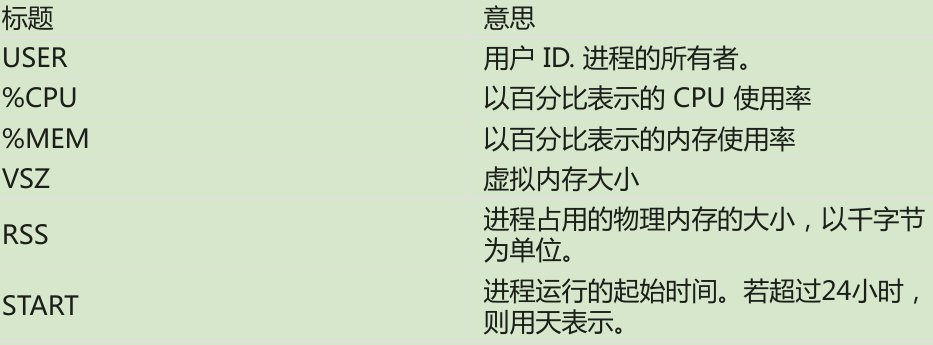

## 权限
chmod

unmask

### 更改用户
```shell
su [-[l]] [user]
```
-l选项会为指定用户启动一个需要登陆的shell，加载该用户的shell环境，并且
工作目录会更改到这个用户的家目录;

如果不指定目录就假定是root，"-l"选项可以缩写为"-";
```shell
# 退出
exit
```

```shell
# 只执行单个命令不启动一个新的shell
su -c 'command'

# 查看sudo命令可以授予哪些权限
sudo -l
```


### 更改文件所有者和用户组
```shell
chown [owner][:[group]] file ...

# 把文件所有者从当前属主更改为用户laughing
chown laughing file
# 把文件所有者改为用户laughing,文件用户组改为用户组 users。
chown laughing:users file
# 把文件用户组改为用户组users, 文件所有者不变
chown :users file
# 文件所有者改为用户laughing,文件用户组改为,用户laughing登录系统时,所属的用户组
chown laughing: file
```

### 更改用户密码
```shell
passwd [user]
```

## 进程
- ps – 报告当前进程快照
- top – 显示任务
- jobs – 列出活跃的任务
- bg – 把一个任务放到后台执行
- fg – 把一个任务放到前台执行
- kill – 给一个进程发送信号
- killall – 杀死指定名字的进程
- shutdown – 关机或重启系统

### ps

```shell
[me@linuxbox ~]$ ps
PID TTY       TIME CMD
5198 pts/1    00:00:00 bash
10129 pts/1   00:00:00 ps
```

```shell
# ps x展示所有进程
[me@linuxbox ~]$ ps x
PID TTY STAT       TIME CMD
2799 ?  Ssl        0:00 /usr/libexec/bonobo-activation-server –ac
2820 ?  Sl         0:01 /usr/libexec/evolution-data-server-1.10 --
```
STAT：state表示进程状态
| 状态 | 意义                                 |
|------|--------------------------------------|
| R    | 运行                                 |
| S    | 睡眠                                 |
| D    | 不可中断睡眠                         |
| T    | 已停止                               |
| Z    | 僵尸进程                             |
| <    | 高级优先级进程，可能会赋予更多的资源 |
| N    | 低优先级进程                         |


```shell
ps aux
```
 
 

### top
 

| 行号          | 字段                                                     | 意义                             |
|---------------|----------------------------------------------------------|----------------------------------|
| 1             | top                                                      | 程序名                           |
| 14:59:20      | 当前时间                                                 |                                  |
| up 6:30       | 计算机从上次启动的运行时间                               |                                  |
| 2 users       | 有两个用户登录系统                                       |                                  |
| load average: | 等待运行的进程数量,三个值分别表示1min,5min,15min的平均值 |                                  |
| 2             | Tasks                                                    | 总结了进程数目和各种进程状态     |
| 3             | Cpu(s):                                                  | 描述CPU正在执行的进程特性        |
| 0.7%us        | CPU使用率                                                |                                  |
| 1.0%sy        | 1.0%的cpu时间被用于系统(内核)进程                        |                                  |
| 0.0%ni        | 于"nice"(低优先级)进程                                   |                                  |
| 98.3%id       | 98.3%的CPU时间是空闲的                                   |                                  |
| 0.0%wa        | 0.0%的CPU时间来等待I/O                                   |                                  |
| 4             | Mem:                                                     | 展示物理内存使用情况             |
| 5             | Swap:                                                    | 展示交换分区(虚拟内存)的使用情况 |

### 控制进程

```shell
# 后台运行command命令, 但是当前终端不能关闭
test.sh &

# 查看后台进程
jobs
```
output:
```shell
[1]+ Running    test.sh &
```

```shell
# 让一个进程返回前台执行
# Ctrl+z可以停止进程
fg %1

# 恢复后台运行
bg %1
```

#### kill命令给进程发送信号
这个 kill 命令不是确切地“杀死”程序,而是给程序 发送信号。信号是操作系统与程序之间进行通信,所采用的几种方式中的一种.
Ctrl-c会发送一个叫做INT(中断)的信号,Ctrl-z会发送一个叫做TSTP(终端停止)的信号；

```shell
kill [-signal] PID
```
当没有指定signal的时候，会发送TERM(终止)信号.
| 编号 | 名字 | 含义                                                                                            |
|------|------|-------------------------------------------------------------------------------------------------|
| 1    | HUP  | <++>                                                                                            |
| 2    | INT  | 中断，与ctrl-c一样，终止程序                                                                    |
| 9    | KILL | 杀死，内核立即终止这个进程, 它没有机会去做些“清理”工作,或者是保存劳动成果。                    |
| 15   | TERM | 终止，这是 kill 命令发送的默认信号。如果程序仍然“活着”,可以接受信号,那么这个信号终止            |
| 18   | CONT | 继续，停止一段时间后，进程恢复运行                                                              |
| 19   | STOP | 停止， 这个信号导致进程停止运行,而没有终止。像 KILL 信号,它不被 发送到目标进程,因此它不能被忽略 |

系统常使用的信号
| 编号 | 名字  | 含义                 |
|------|-------|----------------------|
| 3    | QUIT  | 退出                 |
| 11   | SEGV  | 段错误               |
| 20   | TSTP  | 终端停止，就像ctrl-z |
| 28   | WINCH | 改变窗口大小         |

```shell
# 查看完成信号列表
kill -l
```
#### killall
```shell
# 通过 killall 命令,给匹配特定程序或用户名的多个进程发送信号
killall [-u user] [-singal] name
```
```shell
[me@linuxbox ~]$ xlogo &
[1] 18801
[me@linuxbox ~]$ xlogo &
[2] 18802
[me@linuxbox ~]$ killall xlogo
[1]- Terminated   xlogo
[2]+ Terminated   xlogo
```

### 其他进程相关命令

| 命令名 | 描述                                                                                                                                                                  |
|--------|-----------------------------------------------------------------------------------------------------------------------------------------------------------------------|
| pstree | 输出一个树型结构的进程列表,这个列表展示了进程间父/子关系                                                                                                              |
| vmstat | 输出一个系统资源使用快照,包括内存,交换分区和磁盘 I/O。 为了看到连续的显示结果,则在命令名后加上延时的时间(以秒为单位)。例如,“vmstat 5”。 终止输出,按下 Ctrl-c 组合键 |
| xload  | 一个图形界面程序，可以画出系统负载的图形                                                                                                                              |
| tload  | 与 xload 程序相似,但是在终端中画出图形                                                                                                                                |

## shell环境
shell 在环境中存储了两种基本类型的数据,虽然对于 bash 来说,很大程度上这些类型是不可 辨别的。
它们是环境变量和 shell 变量。Shell 变量是由 bash 存放的少量数据,而剩下的基本上都是环境变量。
除了变量,shell 也存储了一些可编程的数据,命名为别名和 shell 函数。

### 查看环境变量
```shell
# 查看全部环境变量
printenv | less

# 查看指定变量
printenv USER

# printenv仅显示环境变量，set会显示环境变量和shell变量
set | less

# echo显示变量
echo $HOME
echo $PATH
```

如果 shell 环境中的一个成员既不可用 set 命令也不可用 printenv 命令显示,则这个变量是别名。 输入不带参数的 alias 命令来查看它们:
```shell
alias
```

### 一些shell变量介绍
| 变量    | 内容                                                             |
|---------|------------------------------------------------------------------|
| DISPLAY | 显示器名字，通常为":0"                                           |
| EDITOR  | 文本编辑器的名字                                                 |
| SHELL   | shell程序的名字                                                  |
| HOME    | 家用户目录                                                       |
| LANG    | 定义字符集以及语言编码方式                                       |
| OLD_PWD | 先前的工作目录                                                   |
| PAGER   | 页输出程序的名字，通常设置为/usr/bin/less                        |
| PATH    | 由冒号分开的目录列表,当你输入可执行程序名后,会搜索这个目录列表。 |
| PS1     | 定义了shell提示符的内容                                          |
| PWD     | 当前工作目录                                                     |
| TERM    | 终端类型名,该变量设置终端模拟器所用的协议                        |
| TZ      | 指定你所在的时区                                                 |
| USER    | 用户名                                                           |

### shell环境
当我们登录系统后,启动 bash 程序,并且会读取一系列称为启动文件的配置脚本, 这些文件定义了默认的可供所有用户共享的 shell 环境。
然后是读取更多位于我们自己家目录中 的启动文件,这些启动文件定义了用户个人的 shell 环境。
精确的启动顺序依赖于要运行的 shell 会话 类型。有两种 shell 会话类型:一个是登录 shell 会话,另一个是非登录 shell 会话。
- 登录shell会话会提示用户输入用户名和密码;
- 当在GUI模式下运行终端会话时,非登录shell会话会出现;

**登陆shell会话的启动文件**
| 文件            | 内容                                                       |
|-----------------|------------------------------------------------------------|
| /etc/profile    | 应用与所有用户的全局配置脚本                               |
| ~/.bash_profile | 用户私人的启动文件，可以用来扩展或重写全局配置脚本中的设置 |
| ~/.bash_login   | 如果~/.bash_profile没找到，bash会尝试读取这个脚本          |
| ~/.profile      | 如果上面两个文件都没找到，bash会尝试读取这个文件           |
**非登陆shell会话的启动文件**
| 文件             | 内容                                                       |
|------------------|------------------------------------------------------------|
| /etc/bash.bashrc | 应用于所有用户的全局配置文件                               |
| ~/.bashrc        | 用户私有的启动文件，可以用来扩展或重写全局配置脚本中的设置 |

## 定制shell提示符
<++>

## 编写shell脚本
<++>


## 正则表达式
<++>

xresource可以设置X client应用的colorscheme和字体等
xrdb命令可以加载xresource文件
wal(pywal)中就是调用了xrdb命令
