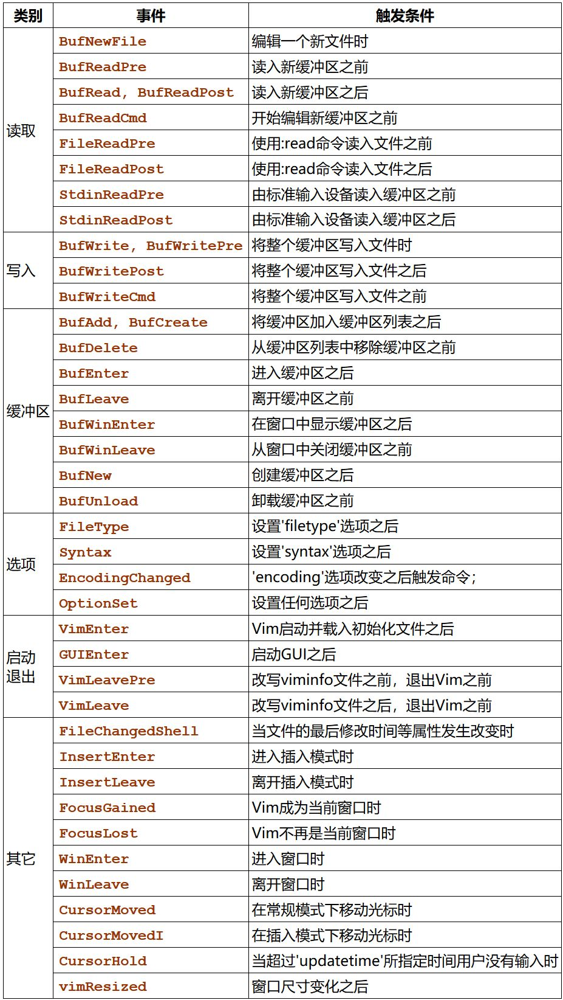

<!-- TOC GFM -->

- [Vim shortcut](#vim-shortcut)
	+ [shortcut](#shortcut)
	+ [Command Mode](#command-mode)
- [Plugs](#plugs)
	+ [Window management](#window-management)
	+ [Tab management](#tab-management)
	+ [Markdown](#markdown)
	+ [Others](#others)
	+ [GitGutter](#gitgutter)
	+ [coc-nvim](#coc-nvim)
	+ [FZF](#fzf)
	+ [Leaderf](#leaderf)
	+ [vim-visual-multi](#vim-visual-multi)
	+ [Far.vim](#farvim)
	+ [Bullets.vim](#bulletsvim)
	+ [fzf.gitignore](#fzfgitignore)
	+ [tabular](#tabular)
	+ [vim-after-object](#vim-after-object)
	+ [suda.vim](#sudavim)
	+ [vim-markdown-toc](#vim-markdown-toc)
	+ [rnvimr](#rnvimr)
	+ [vim-rooter](#vim-rooter)
	+ [AsyncRun](#asyncrun)
	+ [agit.vim](#agitvim)
- [Vim](#vim)
	+ [autocmd](#autocmd)
	+ [function](#function)
	+ [cnoreabbrev](#cnoreabbrev)
	+ [map](#map)

<!-- /TOC -->

### Vim shortcut
#### shortcut
| shortcut   | command             | motions          | mode |
|------------|---------------------|------------------|------|
| Y          | y$                  | 复制到行尾       | n    |
| Y          | "+y                 | 复制到系统剪切板 | v    |
| <LEADER>dw | /\(\<\w\+\>\)\_s*\1 | 找到邻近的重复词 |      |
| <LEADER>tt | :%s/    /\t/g       | 使用tab代替空格  | n    |
| <LEADER>tt | :s/    /\t/g        | 使用tab代替空格  | v    |
| <LEADER>o  | za                  | 折叠             | <++> |
| <++>       | <++>                | <++>             | <++> |
| <++>       | <++>                | <++>             | <++> |
| <++>       | <++>                | <++>             | <++> |
| <++>       | <++>                | <++>             | <++> |
| <++>       | <++>                | <++>             | <++> |

#### Command Mode
| shortcut | command      | motions |
|----------|--------------|---------|
| <C\-a>   | \<Home\>     | <++>    |
| <C\-e>   | \<End\>      | <++>    |
| <C\-i>   | \<Up\>       | <++>    |
| <C\-k>   | \<Down\>     | <++>    |
| <C\-j>   | \<Left\>     | <++>    |
| <C\-l>   | \<Right\>    | <++>    |
| <M\-b>   | \<S\-Left\>  | <++>    |
| <M\-w>   | \<S\-Right\> | <++>    |

### Plugs
#### Window management
| shortcut | command        | motions                  | mode |
|----------|----------------|--------------------------|------|
| LEADER+w | <C\-w>w        | 回到上一个窗口           | <++> |
| qf       | <C\-w>o        | 关闭其他窗口             | <++> |
| sh       | <C\-w>t<C\-w>K | 切换窗口划分，左右->上下 | <++> |
| sv       | <C\-w>k<C\-w>H | 切换窗口划分，上下->左右 | <++> |
| LEADER+q | <C\-w>j:q<CR>  | 关闭当前窗口前一个窗口   | <++> |
| <++>     | <++>           | <++>                     | <++> |
| <++>     | <++>           | <++>                     | <++> |

#### Tab management
| shortcut | command       | motions             | mode |
|----------|---------------|---------------------|------|
| tmj      | :-tabmove<CR> | 向前移动该tab的位置 | <++> |
| tml      | :+tabmove<CR> | 向后移动该tab的位置 | <++> |
| <++>     | <++>          | <++>                | <++> |
| <++>     | <++>          | <++>                | <++> |
| <++>     | <++>          | <++>                | <++> |

#### Markdown
| shortcut | command | motions | mode |
|----------|---------|---------|------|
| <++>     | <++>    | <++>    | <++> |
| <++>     | <++>    | <++>    | <++> |
| <++>     | <++>    | <++>    | <++> |

| command                                         | motions                                          |
|-------------------------------------------------|--------------------------------------------------|
| autocmd BufRead,BufNewFile \*.md setlocal spell | 自动设置读取md文件和创建新md文件时, 设置拼写检查 |


#### Others
| shortcut      | command                                            | motions                                   | mode |
|---------------|----------------------------------------------------|-------------------------------------------|------|
| <++>          | :term sh -c 'st'                                   | terminal执行st命令                        | <++> |
| LEADER+/      | :set splitbelow<CR>:split<CR>:res +10<CR>:term<CR> | 在下方打开terminal                        | <++> |
| LEADER+LEADER | <Esc>/<++><CR>:nohlsearch<CR>c4l                   | 找到下一个<++>并替换进入插入模式          | <++> |
| <++>          | <++>                                               | <++>                                      | <++> |
| LEADER+sc     | :set spell!<CR>                                    | 设置拼写检查                              | <++> |
| tx            | :r !figlet                                         | 写入艺术字                                | <++> |
| LEADER+sw     | :set wrap<CR>                                      | 设置自动折行,多行显示单行，但不添加换行符 | <++> |
| <F10>         | :call SynGroup()<CR>                               | 显示高亮                                  | <++> |
| LEADER+B      | :call BufCloseOthers()<CR>                         | 关闭其他缓冲区，仅保留当前缓冲区          | <++> |
| r             | :call CompileRunGcc()<CR>                          | 执行文件                                  | <++> |
| <++>          | <++>                                               | <++>                                      | <++> |
| <++>          | <++>                                               | <++>                                      | <++> |

#### GitGutter
| shortcut  | command                | motions                | mode |
|-----------|------------------------|------------------------|------|
| LEADER+gf | :GitGutterFold<CR>     | 遮挡未修改的地方       | <++> |
| LEADER+g- | :GitGutterPrevHunk<CR> | 跳转到上一个修改的地方 | <++> |
| LEADER+g= | :GitGutterNextHunk<CR> | 跳转到下一个修改的地方 | <++> |
| <++>      | <++>                   | <++>                   | <++> |
| <++>      | <++>                   | <++>                   | <++> |

| command                              | motions                                      |
|--------------------------------------|----------------------------------------------|
| autocmd BufEnter * silent! lcd %:p:h | 自动设置进入缓冲区时切换为当前文件所在文件夹 |


#### coc-nvim
```vim
" pumvisible()表示是否有补全列表
" 函数表示如果有补全列表则执行<C\->p, 否则执行<C\-h>
inoremap <expr><S-TAB> pumvisible() ? "\<C-p>" : "\<C-h>"

" 如果有补全列表，则执行C-n, 否则如果光标前无字符则执行普通<TAB>, 
" 如果有字符则coc#refresh()触发补全
inoremap <silent><expr> <TAB>
	\ pumvisible() ? "\<C-n>" :
	\ <SID>check_back_space() ? "\<TAB>" :
	\ coc#refresh()
```
| shortcut   | command                            | motions                          | mode |
|------------|------------------------------------|----------------------------------|------|
| LEADER+h   | :call Show_documentation()<CR>     | 查看光标所在处文档               | n    |
| <C-o>/TAB  | coc#refresh()                      | 触发补全                         | <++> |
| LEADER+d   | :CocList diagnostics<CR>           | 查看代码诊断                     | <++> |
| LEADER+'-' | <Plug>(coc-diagnostic-prev)        | 上一个诊断位置                   | <++> |
| LEADER+'=' | <Plug>(coc-diagnostic-next)        | 下一个诊断位置                   | <++> |
| <C\-c>     | :CocCommand<CR>                    | 查看coc命令                      | <++> |
| space+y    | :<C-u>CocList -A --normal yank<cr> | 查看剪切板                       | n    |
| gd         | <Plug>(coc-definition)             | 跳转到函数定义地方               | <++> |
| gD         | :tab sp<CR><Plug>(coc-definition)  | 以新标签页跳转到函数定义地方     | <++> |
| gr         | <Plug>(coc-references)             | 查看光标下变量在文件中的所有位置 | <++> |
| LEADER+rn  | <Plug>(coc-rename)                 | 批量改名字                       | <++> |
| gy         | <Plug>(coc-type-definition)        | <++>                             | <++> |
| tt         | :CocCommand explorer               | 文件树                           | <++> |
| ts         | <Plug>(coc-translator-p)           | 翻译光标所在单词                 | <++> |
| LEADER+a   | <Plug>(coc-codeaction-selected)    | <++>                             | x    |
| LEADER+aw  | <Plug>(coc-codeaction-selected)    | <++>                             | n    |
| <++>       | <++>                               | <++>                             | <++> |
| <++>       | <++>                               | <++>                             | <++> |

```vim
" 设置每天自动更新coc插件
"coc.preferences.extensionUpdateCheck": "daily"
```
| command                         | motions             |
|---------------------------------|---------------------|
| :CocInstall coc-prettier@1.1.17 | 指定版本安装coc插件 |
| :CocCommand                     | 查看coc命令         |
| :CocUpdate                      | 更新插件            |
| :CocList extensions             | 查看插件            |
|                                 | <++>                |
| <++>                            | <++>                |
| <++>                            | <++>                |

**:CocList extensions** 
* `?` means invalid extension
* `*` means extension is activated
* `+` means extension is loaded
* `-` means extension is disabled

Supported actions (hit `<Tab>` to activate action menu):

* `toggle` default action. activate/deactivate selected extension(s).
* `enable`: enable selected extension(s).
* `disable`: disable selected extension(s).
* `reload`: reload selected extension(s).
* `uninstall`: remove selected extension(s).
* `lock`: toggle lock of extension, locked extension won't be updated by `:CocUpdate`


#### FZF
需要安装fzf和fzf.vim
| shortcut | command           | motions                              | mode |
|----------|-------------------|--------------------------------------|------|
| <C\-p>   | :Leaderf file<CR> | 查找该文件所在文件夹下的文件         | n    |
| <C\-f>   | :Rg<CR>           | 在该文件夹下查找，可通过文件内容查找 | <++> |
| <C\-h>   | :History<CR>      | 根据历史查找                         | <++> |
| <C\w>    | :Buffers<CR>      | 查找缓冲区                           | <++> |
| LEADER+; | :History:<CR>     | 命令行的历史                        | <++> |
| <C\-d>     | :BD              | 删除缓冲区                                 | <++> |
| <++>     | <++>              | <++>                                 | <++> |
| <++>     | <++>              | <++>                                 | <++> |

```vim
" 设置<C-i>, <C-k>上下移动
" 在.zshrc/.bashrc中设置
export FZF_DEFAULT_OPTS="--bind ctrl-k:down,ctrl-i:up"

也可以直接在init.vim中设置, 还行不行，还是需要.zshrc配置
let g:fzf_bind = {'ctrl-k':'down', 'ctrl-i':'up'}
```

#### Leaderf
| shortcut | motions     |
|----------|-------------|
| <C\-p>   | 打开Leaderf |
以下命令基于Leaderf已打开
copy from [https://github.com/Yggdroot/LeaderF](https://github.com/Yggdroot/LeaderF) 
| Command                    | Description
| -------                    | -----------
| `<C-C>`<br>`<ESC>`         | quit from LeaderF
| `<C-R>`                    | switch between fuzzy search mode and regex mode
| `<C-F>`                    | switch between full path search mode and name only search mode
| `<Tab>`                    | switch to normal mode
| `<C-V>`<br>`<S-Insert>`    | paste from clipboard
| `<C-U>`                    | clear the prompt
| `<C-W>`                    | delete the word before the cursor in the prompt
| `<C-J>`                    | move the cursor downward in the result window
| `<C-K>`                    | move the cursor upward in the result window
| `<Up>`/`<Down>`            | recall last/next input pattern from history
| `<2-LeftMouse>`<br>`<CR>`  | open the file under cursor or selected(when multiple files are selected)
| `<C-X>`                    | open in horizontal split window
| `<C-]>`                    | open in vertical split window
| `<C-T>`                    | open in new tabpage
| `<C-\>`                    | show a prompt enable to choose split window method: vertical, horizontal, tabpage, etc
| `<F5>`                     | refresh the cache
| `<C-LeftMouse>`<br>`<C-S>` | select multiple files
| `<S-LeftMouse>`            | select consecutive multiple files
| `<C-A>`                    | select all files
| `<C-L>`                    | clear all selections
| `<BS>`                     | delete the preceding character in the prompt
| `<Del>`                    | delete the current character in the prompt
| `<Home>`                   | move the cursor to the begin of the prompt
| `<End>`                    | move the cursor to the end of the prompt
| `<Left>`                   | move the cursor one character to the left in the prompt
| `<Right>`                  | move the cursor one character to the right in the prompt
| `<C-P>`                    | preview the result
| `<C-Up>`                   | scroll up in the popup preview window
| `<C-Down>`                 | scroll down in the popup preview window

#### vim-visual-multi
| shortcut           | motions            |
|--------------------|--------------------|
| <C\-k>             | 打开选中模式并选中 |
| :help visual-multi | 查看文档           |
| :h vm-mappings.txt | 查看映射文档       |

以下命令基于visual-multi已打开
| shortcut | motions    |
|----------|------------|
| k        | 向下移动   |
| i        | 向上移动   |
| j        | 向左移动   |
| l        | 向右移动   |
| =        | 下一个     |
| -        | 上一个     |
| q        | 取消该选中 |
| <C\-n>   | 跳过选中   |
| <++>     | <++>       |


#### Far.vim
跨文件查找替换
```vim
" 查找替换
:Far {pattern} {replace-with} {file-mask} [params]
" 仅查找
:F {pattern} {file-mask} [params]
" 执行替换操作
:Fardo
```
| shortcut | command                                | motions      |
|----------|----------------------------------------|--------------|
| LEADER+f | :F  **/*<left><left><left><left><left> | 跨文件查找   |
| zL       | expand_all                             | 展开所有     |
| zJ       | collapse_all                           | 收起所有     |
| zl       | expand                                 | <++>         |
| zj       | collapse                               | <++>         |
| X        | exclude_all                            | 去除选中全部 |
| O        | include_all                            | <++>         |
| x        | exclude                                | <++>         |
| o        | include                                | <++>         |
| p        | open_preview                           | <++>         |
| P        | close_preview                          | <++>         |
| rd       | replace_do/:Fardo                      | 替换全部     |
| u        | replace_undo                           | <++>         |
| U        | replace_undo_all                       | <++>         |
| <++>     | <++>                                   | <++>         |


#### Bullets.vim
| shortcut | motions  | mode |
|----------|----------|------|
| <C\-t>   | 子标题   | i    |
| <C\-d>   | 父标题   | i    |
| >>       | 子标题   | v    |
| <<       | 父标题   | v    |
| >        | 子标题   | n    |
| <        | 父标题   | n    |
| gN       | 重新编号 | n/v  |
| LEADER+x | todo打钩 | <++> |
| <++>     | <++>     | <++> |
| <++>     | <++>     | <++> |

#### fzf.gitignore
创建gitignore
| shortcut   | command           |
|------------|-------------------|
| <LEADER>gi | :FzfGitignore<CR> |


#### tabular
| shortcut | command       | mode |
|----------|---------------|------|
| ga       | :Tabularize / | v    |


#### vim-after-object
See [https://github.com/junegunn/vim-after-object](https://github.com/junegunn/vim-after-object) 


#### suda.vim
| command   | motions          | mode |
|-----------|------------------|------|
| SudaRead  | sudo权限打开文件 | c    |
| SudaWrite | sudo权限保存     | c    |
| sw        | sudo保存         | c    |
| <++>      | <++>             | <++> |

#### vim-markdown-toc
生成目录
| command          | motions         | notes                             |
|------------------|-----------------|-----------------------------------|
| :GenTocGFM       | GFM style       | 使用于githubREADM.md              |
| :GenTocRedcarpet | Redcarpet style | <++>                              |
| :GenTocGitLab    | <++>            | <++>                              |
| :GenTocMarked    | <++>            | <++>                              |
| :UpdateToc       | 更新目录        | g:vmt_auto_update_on_save=0时工作 |
| :RemoveToc       | 移除目录        | <++>                              |

#### rnvimr
| command | motions          | notes |
|---------|------------------|-------|
| <C\-t>  | NvimEdit tabedit | <++>  |
| <C\-x>  | NvimEdit split   | <++>  |
| <C\-v>  | NvimEdit vspit   | <++>  |
| <C\-o>  | NvimEdit drop    | <++>  |
| gw      | 切换为nvim目录   | <++>  |
| yw      | 切换为ranger目录 | <++>  |
| <++>    | <++>             | <++>  |


#### vim-rooter
自动将新目录设置为工作目录
```vim
" 指定存在工作目录的文件或文件夹
let g:rooter_patterns = ['__vim_project_root', '.git/']
```

#### AsyncRun
后台运行 shell 命令，并将结果实时显示到 Vim 的 Quickfix 窗口中
```vim
" 与!类似
" 命令会在后台运行，不会妨碍vim操作
:AsyncRun[!] [options] {cmd} ...
%:p     - 当前 buffer 的文件名全路径
%:t     - 当前 buffer 的文件名（没有前面的路径）
%:p:h   - 当前 buffer 的文件所在路径
%:e     - 当前 buffer 的扩展名
%:t:r   - 当前 buffer 的主文件名（没有前面路径和后面扩展名）
%       - 相对于当前路径的文件名
%:h:.   - 相对于当前路径的文件路径
<cwd>   - 当前路径
<cword> - 光标下的单词
<cfile> - 光标下的文件名
<root>  - 当前 buffer 的项目根目录
```

#### agit.vim
查看git提交信息
| shortcut  | command   | motions         |
|-----------|-----------|-----------------|
| LEADER+gl | :Agit<CR> | 查看git提交信息 |


### Vim

#### autocmd
:autocmd [group] events pattern [nested] command
- group，组名是可选项，用于分组管理多条自动命令；
- events，事件参数，用于指明触发命令的一个或多个事件；
- pattern，限定针对符合匹配模式的文件执行命令；
- nested，嵌套标记是可选项，用于允许嵌套自动命令；
- command，指明需要执行的命令、函数或脚本。
 

:autocmd FileWritePre * :callDateInsert()<CR>
在保存文件的时候自动执行函数callDateInsert()

#### function
```vim
fu[nction][!] {name}([arguments]) [range] [abort] [dict] [closure]
" name必须以字母数字或_开头, 开头必须大写或以s:开头
" s:表示局部变量
```

```vim
redir 重定向
redir > {file} "重定向到file
redir! > {file} "强制覆盖file
redir >> {file} "追加
redir END "结束重定向

" 返回缓冲区列表的函数
function! s:list_buffers()
  redir => list
  silent ls
  redir END
  return split(list, "\n")
endfunction

" 删除一个buffer
function! s:delete_buffers(lines)
  execute 'bwipeout' join(map(a:lines, {_, line -> split(line)[0]}))
endfunction

" 定义命令行调用函数function
" :BD调用
command! BD call function

" 判断光标前面是否为空"
function! s:check_back_space() abort
	let col = col('.') - 1
	return !col || getline('.')[col - 1]  =~# '\s'
endfunction

```

#### cnoreabbrev
cnoreabbrev 改变command命令功能
```vim
" suda://%映射为sw
cnoreabbrev sudowrite w suda://%
cnoreabbrev sw w suda://%
```

#### map
```vim
" <silent> 表示屏蔽命令的输出
" <expr> 在rhs的位置指定一个表达式，vim会eval这个表达式，并将表达式的值作为真正的rhs序列
" 但<expr>也有些限制，有时候需要用到<c-r>=配合使用

example:
inoremap <silent><expr> <c-o> coc#refresh()

function! coc#refresh() abort
  return "\<c-r>=coc#start()\<CR>"
endfunction

" <buffer>    当前buffer有效
" <nowait>   当你为","定义了buffer-local的映射, 而全局的映射中又有可能存在以","为前缀的映射，这时vim就会等待下一个字符的输出来判定使用哪个映射，而使用<nowait>则会避免这种情况，直接使用","的映射
" <silent>    在执行时不显示执行的命令
" <script>
" <unique> 命令必须没有定义过，否则出错
" <expr>     把右边的定义当作表达式运行
` `

```

- [ ] snippets
- [ ] vimtex
- [ ] vim-easymotion
- [ ] vim-spector
- [ ] vim-subversive
- [ ] lazygit.nvim
- [X] coc-nvim


