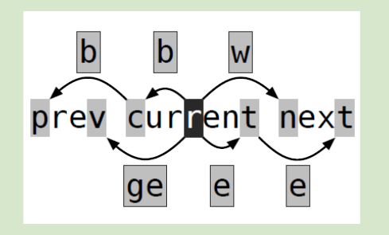
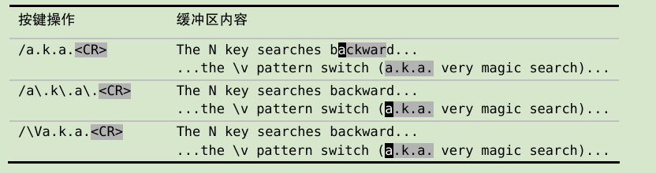
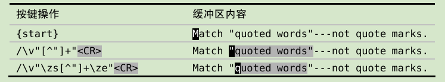
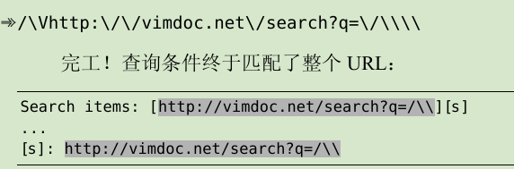
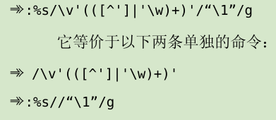

* [模式](#模式)
  - [普通模式](#普通模式)
  - [插入模式](#插入模式)
  - [替换模型](#替换模型)
  - [可视模式](#可视模式)
  - [命令模式](#命令模式)
* [文件](#文件)
* [更快的移动](#更快的移动)
  - [文本之间的移动](#文本之间的移动)
  - [文件之间的跳转](#文件之间的跳转)
* [寄存器](#寄存器)
  - [复制与粘贴](#复制与粘贴)
  - [宏](#宏)
* [模式](#模式-1)
  - [查找](#查找)
  - [替换](#替换)
* [工具](#工具)
  - [自动补全](#自动补全)
* [拼写检查](#拼写检查)

## 模式
### 普通模式

 - b到词首
 - w到下一个单词首
 - e到词尾
 - e与w不同的是：比如说de会删除到词尾，dw会删除到下一个单词首的前一个位置（不会删除下一个单词首）,也就是删除到词尾+一个空格；

	"the test for e/w"  -> de -> " test for e/w"

	"the test for e/w"  -> dw -> "test for e/w"

 - vim动作指令：w代表word，p代表段落

 - vim操作符:	c,d,y

| command | motions                            |
|---------|------------------------------------|
| gU      | 转换为大写                         |
| gu      | 转换为小写                         |
| g~      | 翻转大小写                         |
| >       | 增加缩进                           |
| <       | 减少缩进                           |
| =       | 自动缩进                           |
| !       | 使用外部程序过滤{motion}所跨越的行 |

操作符+动作指令=操作
d{motion}，dl,diw,dip;

| command | motions |
|---------|---------|
| <C\-a>  | 数字加  |
| <C\-x>  | 数字减  |

### 插入模式
| command   | motions        |
|-----------|----------------|
| <C\-h>    | 删除前一个字符 |
| <C\-w>    | 删除前一个单词 |
| <C\-u>    | 删完一行       |
| ESC/<C\-[ | 切换到普通模式 |

| command                 | motions                                                  |
|-------------------------|----------------------------------------------------------|
| <C\-r>{register}        | 插入模式下粘贴寄存器的内容                               |
| <C\-r><C\-p>{register}  | 更智能的粘贴，按原义插入寄存器内容并修正任何不必要的缩进 |
| <C\-r>={expression}<CR> | 表达式寄存器，输出expression的结果                       |

**使用字符编码插入字符** 
| command              | motions                                         | notes           |
|----------------------|-------------------------------------------------|-----------------|
| <C\-v>{code}         | 使用字符编码插入字符                            |                 |
| <C\-v>{123}          | 以十进制字符(dec)编码插入字符                   | <C\-v>065 -> A   |
| <C\-v>u{1234}        | 以十六进制字符(hex)编码插入字符                 | <C\-v>u00bf -> ¿ |
| <C\-v>{nondigit}     | 按原义插入非数字字符                            |                 |
| <C\-k>{char1}{char2} | 插入以二合字母{char1}{char2}表示的字符(digraph) | <C\-k>14 -> ¼   |
**Tips： :h digraphs-default查看二合字母集文档,:digraphs/:h digraph-table查看字符字典；** 

### 替换模型
R键进入插入模式，也可以使用insert键；

gR:虚拟替换模式,会按照屏幕上实际的宽度来替换字符，而不是按文件中所保存的字符进行替换，这样会减少意外的发生，所以一般推荐使用虚拟替换模式；

r{char}和gr{char}:覆盖一个字符然后返回普通模式；

### 可视模式
| command | motions                                | notes |
|---------|----------------------------------------|-------|
| v       | 选中当前字符，重复两次回到普通模式     |       |
| V       | 选中当前整行，重复两次回到普通模式     |       |
| <C\-v>  | 选中块，重复两次回到普通模式           |       |
| gv      | 重选上次高亮区域                       |       |
| o       | 切换高亮选取的活动端，即切换选取的两端 |       |

| command                 | motions                                                  |
|-------------------------|----------------------------------------------------------|
| u                       | 可视模式下将字母转换为大写                               |
| :normal +普通模式下命令 | 可以在可视模式下生效普通模式的命令，如可以多行添加文本等 |
| <C\-v> + i/a            | 可在所有块前/后添加文本                                  |
| <C\-v> + c              | 同时编辑所有块的内容                                     |
**Tips：i/a在可视模式下会被当做是文本对象的组成部分，不能进入插入模式,进入插入模式使用I/A；** 

gh/gH: 进入选择模式,看起来像是可视模式，但不同得是在选择模式下输入任意可见字符都会替换内容并切换到插入模式,使用的较少；

### 命令模式
在命令行执行的命令又称为Ex命令；

Ex命令的影响范围广且距离更远，普通模式命令适合本地操作，而Ex则可以远距离操作

| command                                       | motions                                                   | notes                         |
|-----------------------------------------------|-----------------------------------------------------------|-------------------------------|
| :h ex-cmd-index                               | 查看完整Ex命令列表                                        |                               |
| :[range]delete [x]                            | 删除指定范围内的行[到寄存器x中]                           | x好像表示的是从range开始的x行 |
| :[range]yank [x]                              | 复制指定范围内的行[到寄存器x中]                           | x好像表示的是从range开始的x行 |
| :[line]put [x]                                | 在指定行后粘贴寄存器x中的内容                             | x好像表示的是从line开始的x行  |
| :[range]copy {address}                        | 把指定范围内的行拷贝到{address}所指定的行中               |                               |
| :[range]move {address}                        | 把指定范围内的行移动到{address}所指定的行中               |                               |
| :[range]join                                  | 连接指定行的内容                                          |                               |
| :[range]normal {commands}                     | 对指定范围的每一行执行普通模式命令{commands}              |                               |
| :[range]substitute/{pattern}/{string}/[flags] | 把指定范围内出现{pattern}的地方替换为string               |                               |
| :[range]global/{pattern}/[cmd]                | 对指定范围的匹配{pattern}的所有行，在其上执行Ex 命令{cmd} |                               |
**Tips：有些插入模式中的命令也可以在命令行使用，比如：<C\-w>,<C\-u>,<C\-v>,<C\-k>,<C\-r>{register}等；** 

- [range]可以是行号([1,3]表示1到3行)，位置标记或查找模式来指定；
- {address}可以是一个行号，一个位置标记，或者查找模式；
- range的一般格式为:{start},{end}；

**地址指定范围range**
| command | motions                          |
|---------|----------------------------------|
| 行号    | 文件第几行                       |
| .       | 当前行                           |
| %       | 当前文件所有行, :1,$的简写       | 
| 0       | 行号，虚拟行，位于文件第一行上方 |
| 'm      | 表示包含位置标记m的行            |
| '<      | 高亮区域的起始行                 |
| '>      | 高亮区域的结束行                 |

:%s/a/b: 把每一行的第一个a换成b, s为substitute缩写；

**可视模式高亮选中指定范围**

再输入Ex命令, :'<,'>；其中'<表示选区首行位置标记，'>表示尾行位置标记；

**用模式指定范围**
| command                 | motions                                   |
|-------------------------|-------------------------------------------|
| :/\<html\>/,/<\/html>/p | 由\<html\>所在行开始，\</html\>所在行结束 |

**使用偏移对地址进行修正**
| command                     | motions                                               |
|-----------------------------|-------------------------------------------------------|
| :/\<html\>/+1,/<\/html>/-1p | 由\<html\>所在行下一行开始，\</html\>所在行上一行结束 |
| :.,.+3p                     | 当前行到往下3行的位置                                 |

**使用:t和:m复制和移动行** 
| command                | motions                                            |
|------------------------|----------------------------------------------------|
| :[range]copy {address} | 把指定范围内的行拷贝到{address}所指定的行中        |
| :t/co                  | :copy的简写                                        |
| :6t.                   | 把第6行复制到当前行下方                            |
| :t6                    | 把当前行复制到第6行下方                            |
| :t.                    | 相当于yyp，但yyp会使用寄存器，该命令不会使用寄存器 |
| :t$                    | 把当前行复制到文本结尾                             |
| :'<,'>t0               | 把高亮选中的行复制到文件开头                       |
**Tips：复制距离较远时，:t命令更有效** 

| command                | motions                                       |
|------------------------|-----------------------------------------------|
| :[range]move {address} | 把指定范围内的行移动到{address}所指定的行中   |

**指定范围执行普通命令** 
| command                    | motions                   | notes                                                                   |
|----------------------------|---------------------------|-------------------------------------------------------------------------|
| :[range]normal [normalcmd] | 指定范围range使用普通命令 | :%normal A 在该文本所有行结尾添加文本, :%normal i//在所有行前面添加注释 |

**Tips：高亮选中之后:'<,'>normal就为指定一个范围执行普通命令, .命令也可以和normal使用。**

**重复执行上次的Ex命令** 
| command | motions                          |
|---------|----------------------------------|
| @:      | 执行上一次的Ex命令               |
| @@      | 执行过一次@:之后可以用该命令重复 |
**Tips：:normal可以执行普通模式的任意命令,Ex命令作用范围更广，距离更远，使用:normal与具有强大表现力的普通模式命令结合；** 

**自动命令补全** 
| command      | motions                  |
|--------------|--------------------------|
| :col<C\-d>   | 命令自动补全列表         |
| <C\-r><C\-w> | 复制光标下的单词到命令行 |
| <C\-r><C\-a> | 复制光标下的字串到命令行 |

**调用外部shell**  
| command                | motions                                                | notes                                  |
|------------------------|--------------------------------------------------------|----------------------------------------|
| {command} \| {command} | 合并多条命令                                           | :write \| !python % 保存并运行当前文件 |
| q:                     | 查看Ex历史命令                                         | 可通过vim编辑修改命令，然后<CR>运行    |
| <C\-f>                 | 在命令模式输入时，在保留已输入命令的情况下查看历史命令 |                                        |
| :!{command}             | 调用外部shell程序                                      |                                        |
**Tips：vim也提供了一组文件名修饰符，可以在文件名中提取文件路径或扩展名之类的，详见:h filename-modifiers；** 

**<C-z>可以在bash中挂起某个进程，然后jobs可以查看stopped的进程，fg可以将后台挂起进程唤醒；**

**将缓冲区内容作为标准输入或输出**
| command              | motions                                             | notes        |
|----------------------|-----------------------------------------------------|--------------|
| :read !{cmd}         | 可以把shell命令的输出读入到当前缓冲区中             |              |
| :write !{cmd}        | 与read相反，把当前缓冲区内容作为指定{cmd}的标准输入 | 部分命令支持 |
| :[range]write !{cmd} | 以range范围作为标准输入执行shell命令cmd             |              |

**使用外部命令过滤缓冲区内容**
| command             | motions                                       | notes                 |
|---------------------|-----------------------------------------------|-----------------------|
| :[range]!{filter}   | range中指定文本会被指定的{cmd}进行过滤,如sort |                       |
| :2,$!sort -t',' -k2 | 将第二行到最后一行sort进行排序                | -t',' -k2位sort的参数 |

**Tips：Vim提供了一种方便的快捷方式设置:[range]!{filter}命令中的范围，可以用!{motion}操作符，比如将光标放在某一行，然后执行!G，vim就会打开命令行并输入:.,$!预置命令；**

## 文件
- 文件与缓存区：文件是存在磁盘的，缓冲区是vim读取文件到内存中，当vim打开文件时，该文件的内容被读入一个具有相同名字的缓冲区；
- vim允许同时在多个缓冲区上工作：
- vim \*.py会打开多个文件，vim会显示一个窗口，对应第一个缓冲区的内容，其他文件也被载入到后台的缓冲区，可以通过:ls查看后台缓冲区列表；

**缓冲区** 
| command                 | motions                                  | notes                  |
|-------------------------|------------------------------------------|------------------------|
| :ls                     | 查看后台缓冲区列表                       | <++>                   |
| :bprev/bnext            | 切换到上/下一个缓冲区                    | <++>                   |
| :bfirst/blast           | 切换到列表的开头结尾                     | <++>                   |
| :buffer N               | 直接跳到编号的缓冲区                     | <++>                   |
| :bufdo {cmd}            | 可以在:ls列出的所有缓冲列表执行Ex命令    | <++>                   |
| :bd[elete] N1 N2 N3 ... | 删除缓冲区                               | <++>                   |
| :qa[ll]!                | 关闭所有窗口，摒弃修改而无需警告         | <++>                   |
| :wa[ll]!                | 把所有改变的缓冲区写如磁盘               | <++>                   |
| :argdo/bufdo {cmd}      | 可以修改一组缓冲区，前提是设置了‘hidden’ | 设置hideen：set hidden |

**窗口** 
| command          | motions                      | notes |
|------------------|------------------------------|-------|
| :on[ly]/<C\-w>o  | 只保留活动窗口，关闭其他窗口 |       |
| :clo[se]/<C\-w>c | 关闭所有窗口                 | <++>  |

**标签页** 
| command     | motions                              | notes |
|-------------|--------------------------------------|-------|
| :tabon[ly]  | 只保留活动标签页，关闭其他所有标签页 | <++>  |
| :tabclo[se] | 关闭所有标签页                       | <++>  |

**打开及保存文件** 
| command        | motions                                        | notes                                                                  |
|----------------|------------------------------------------------|------------------------------------------------------------------------|
| :e[dit] {file} | 通过文件的绝对路径或相对路径来读取文件到缓冲区 |                                                                        |
| %              | 表示活动缓冲区的完整文件路径                   |                                                                        |
| :h             | 该修饰符会去除文件名，但保留路径中的其他部分   | :e %:h 获取当前缓冲区的目录，之后可以按<TAB>来获取当前目录下的其他文件 |
| :find {file}   | 通过文件名打开一个文件，无需输入完整路径       | 需要配置path，set path+=dir                                            |

**保存文件到不存在的目录中**
:edit不存在目录下的文件时，也会创建一个新的缓冲区，只是保存时vim会出现错误信息，此时需要调用外部mkdir补救：

- :!mkdir -p %:h
- :w

-p使mkdir创建任何不存在的中间目录，%:h为当前文件目录；

**以超级用户权限保存文件**
| command                      | motions      | notes                                                                           |
|------------------------------|--------------|---------------------------------------------------------------------------------|
| :w !sudo tee % > /dev/null； | 强制保存文件 | %表示当前文件的完整路径,tee会将缓冲区的内容当做标准输入，并用来覆盖该文件内容； |

## 更快的移动
### 文本之间的移动

**屏幕行与实际行**
| command | motion                       |
|---------|------------------------------|
| gk/j    | 屏幕上下移动                 |
| ^       | 移动到实际行第一个非空白字符 |
| g^      | 移动到屏幕行第一个非空白字符 |

**基于单词移动** 
| command | motion                            | notes                      |
|---------|-----------------------------------|----------------------------|
| w/W     | 正向移动到下一单词开头            | 小写基于单词，大写基于字串 |
| b/B     | 反向移动到当前单词/上一单词的开头 |
| e/E     | 正向移动到当前单词/下一单词的结尾 |
| ge/E    | 反向移动到上一单词的结尾          |
| ea      | 在当前单词结尾添加                |
| gea     | 在上一单词结尾添加                |

 

| command | motion                             |
|---------|------------------------------------|
| f       | 正向移动到下一个{char}所在之处     |
| F       | 反向移动到下一个{char}所在之处     |
| t       | 正向移动到下一个{char}的前一个字符 |
| T       | 反向移动到上一个{char}的后一个字符 |
| ;       | 重复上次的字符查找                 |
| ,       | 翻转方向查找                       |
| dtx     | 删除到向后第一个x前一个字符        |

**通过查找移动** 
| command       | motion                  | notes                 |
|---------------|-------------------------|-----------------------|
| v/{something} | 通过/查找扩大可视区域块 | 其他命令d/y等都一样 |

**用精确的文本对象选择选区** 
| command | motion               | notes               |
|---------|----------------------|---------------------|
| vi}     | 选中花括号以内的区域 | 其他命令d/y/c等都一样 |
| a"      | 扩大区域致包括""     |                     |
一般来说i会选择分隔符内部的文本，a则会包含分隔符

**针对符号** 
| 文本对象 | 选择区域                  |
|----------|---------------------------|
| a)/ab    | 一对()                    |
| i)/ib    | （）内部                  |
| a}/aB    | 一对{}                    |
| i}/iB    | {}内部                    |
| a]       | 一对[]                    |
| i]       | []内部                    |
| at       | 一对XML标签<xml>tags<xml> |
| it       | XML标签内部               |

**针对单词,句子,段落**
| 文本对象 | 选择区域      |
|----------|---------------|
| iw       | 当前单词      |
| aw       | 当前单词+空格 |
| iW       | 当前字串      |
| aW       | 当前字串+空格 |
| is       | 当前句子      |
| as       | 当前句子+空格 |
| ip       | 当前段落      |
| ap       | 当前段落+空行 |
d{motion}与aw，as，ap配合使用, 通常来说c{motion}与iw及类似文本对象使用。

**设置标记** 
| command   | motion                                             | notes                                                          |
|-----------|----------------------------------------------------|----------------------------------------------------------------|
| m{a-zA-Z} | 用选定的字母标记当前光标所在位置                   | 小写字母表示文件内标记，大学字母为全局标记，可以设置在不同文件 |
| '{mark}   | 跳转到相应的位置，把光标置于该行第一个非空白字符上 |
| `{mark}   | 跳转到相应的位置，把光标置于标记时的位置           |

| 位置标记 | 跳转到                         |
|----------|--------------------------------|
| ``       | 当前文件上次跳转动作之前的位置 |
| `.       | 上次修改地方                   |
| `^       | 上次插入地方                   |
| `[       | 上次修改或复制的起始位置       |
| `]       | 上次修改或复制的结束位置       |
| `<       | 上次高亮选取的起始位置         |
| `>       | 上次高亮选取的结束位置         |

**在匹配括号之间跳转** 
| command    | motion                 | notes                  |
|------------|------------------------|------------------------|
| %          | ()/[]/{}之间跳转       |                        |
| S+包围符号 | 将选中文本用该符号包围 | 需要有surround.vim插件 |
| cs}]       | 将花括号}换为中括号]   | 需要有surround.vim插件 |

### 文件之间的跳转
| command | motions            | notes                             |
|---------|--------------------|-----------------------------------|
| C-o     | 后退               | 可在不同文件/同一文件不同位置跳转 |
| C-i     | 前进               | 可在不同文件/同一文件不同位置跳转 |

**跳转到光标下文件** 
| command               | motion             |
|-----------------------|--------------------|
| gf                    | 跳转到光标下的文件 |
| :set suffixesadd+=.rb | 指定文件扩展名     |
| :set path+=dir        | 添加搜索目录       |

## 寄存器
:reg {register}查看寄存器内容
### 复制与粘贴
在没指定寄存器的情况下，默认的复制，剪切都是保存内容到无名寄存器中, 
默认粘贴也是读取无名寄存器的内容;
| command     | motions          | example     | notes                                                                |
|-------------|------------------|-------------|----------------------------------------------------------------------|
| p           | 粘贴文本到光标后 |             |                                                                      |
| P           | 粘贴文本到光标前 |             |                                                                      |
| "{register} | 指定寄存器       | "ayy -> "ap | ""表示无名寄存器，""p与p相同; "_为黑洞寄存器，可删除文本且不保留副本 |

**Ex命令**
| command   | motions                       |
|-----------|-------------------------------|
| :delete c | 把当前行剪切到寄存器c         |
| :put c    | 将寄存器c中的内容粘贴到当前行 |

**复制专用寄存器("0)** 

只用当使用y{motions}的时候才会将内容放入该寄存器，
d/c{motions}/x不会覆盖该寄存器内容,
这样就防止了剪切的时候会覆盖无名寄存器；

**系统粘贴板与选择专用寄存器** 
| 寄存器 | 用途                          | notes                                               |
|--------|-------------------------------|-----------------------------------------------------|
| "+     | X11剪切板，用剪切，复制，粘贴 | "+p可粘贴系统剪切板的内容到vim，或插入模式下<C\-r>+ |
| "*     | X11主剪切板，用鼠标中键操作   |

**表达式寄存器("=)** 
| command     | motions         | notes          |
|-------------|-----------------|----------------|
| :let i = 0  | 创建一个变量i=0 |                |
| let i += 1  | 变量i+1         |                |
| <C\-r>=i<CR> | 获取变量i的值   | 在插入模式运行 |
| "=i<CR>p    | 获取变量i的值   | 普通模式       |

**其他寄存器** 
| 寄存器 | 内容             |
|--------|------------------|
| "%     | 当前文件名       |
| "#     | 轮换文件名       |
| ".     | 上次插入文本     |
| ":     | 上次执行的Ex命令 |
| "/     | 上次查找的模式   |

### 宏
| command            | motions                | notes            |
|--------------------|------------------------|------------------|
| q{register}        | 录制宏                 | 再次按q结束录制  |
| @{register}        | 执行宏命令             |                  |
| @@                 | 回放上一次运行的宏命令 |                  |
| {count}@{register} | 多次执行宏             | 该方式是串行运行 |

**执行方式** 
 - 串行运行 :
类似传送带，挨着挨着执行宏，如果在某次执行遇到错误则终止宏操作
	- {count}@{register}

 - 并行运行 :
多个执行者，同时执行宏，如果在某次执行遇到错误, 也不会终止其他的执行
	- 高亮选中区域+normal @{register}

无论哪种方式都是串行执行的，并不是真正的“并行”，只是方式不同；

**tips: 录制宏时最好采用可重复的操作，如w, b, e, ge, 0, $等**

**给宏追加命令** 
| command | motions         | notes     |
|---------|-----------------|-----------|
| qA      | 在宏a中追加内容 | q结束录制 |

**多个文件同时执行宏** 
(在运行:argdo，:bufdo之前，启用:hidden)
| command          | motions                           | notes                       |
|------------------|-----------------------------------|-----------------------------|
| :argdo normal @a | 对参数列表文件都执行宏a(并行方式) | 串行方式需要在宏中录制:next |

| command      | motions                   |
|--------------|---------------------------|
| :args *.txt  | 加入所有txt文件到参数列表 |
| :argdo write | 保存参数列表中全部文件    |
| :wall        | 保存缓冲区所有文件        |

**编辑宏的内容** 
| command | motions                       | notes                                                       |
|---------|-------------------------------|-------------------------------------------------------------|
| :put a  | 将寄存器a中的内容放到文本中   | "ap会将内容粘贴到光标后面，:put a始终会将其粘贴到光标下一行 |
| 0"ay$   | 将修改后的内容复制到寄存器a中 | 直接"add会包含拖尾字符^j                                    |

## 模式
**调整大小写敏感** 
| command        | motions                | notes                                  |
|----------------|------------------------|----------------------------------------|
| set ignorecase | 全局设置查找忽略大小写 |                                        |
| set smartcase  | 设置更智能的大小写敏感 | 无大写时忽略大小写，有大写时区分大小写 |
| \c             | 忽略大小写             | 可覆盖全局设置                         |
| \C             | 强制区分大小写         | 同上                                   |

**按正则表达式搜索时，开启\v** 

\v模式开关(very magic)来统一所有特殊符号的规则，除了_、大小写字母以及数字0-9之外所有字符都具有特殊意义

\V模式开关(very nomagic)会保持原意, 可以消除附加在.、*以及？等大多数字符上的特殊意义

| command                                 | motions                                  | notes                                        |
|-----------------------------------------|------------------------------------------|----------------------------------------------|
| /#([0-9a-fA-F]\{6}\\\|[0-9a-fA-F]\{3}\) | 使用magic搜索模式查找16进制颜色代码      | 使用magic模式必须转义()、\|、{               |
| /#([0-9a-fA-F]{6}\|[0-9a-fA-F]{3})      | 使用very magic搜索模式查找16进制颜色代码 | 使用\v模式之后，()、 \|、{字符会出现特殊含义 |
| /\v#(\x{6}\| \x{3})                     | 使用very magic搜索模式查找16进制颜色代码 | 使用\x更加精简                               |

 

**使用圆括号捕获子匹配** 
| command        | motions          | notes                                                                                      |
|----------------|------------------|--------------------------------------------------------------------------------------------|
| \v<(w+)\_s+\1> | 匹配重复单词     | ()内匹配的文本会被自动保存到一个临时仓库，可以用\1引用该文本，多个括号可以用\2,\3...\9引用 |
| \v%(And\|D)rew | 匹配Andrew和Draw | %表示不将()的内容赋给寄存器\1                                                              |
**tips** :<>用于匹配单词的边界，\_s匹配空白符或换行符

另外，无论是否使用圆括号，\0会引用整个匹配

**确定单词边界** 
| command     | motions                              |
|-------------|--------------------------------------|
| \v<the><CR> | 仅匹配the，而类似their等单词不会匹配 |

| command | motions                                  |
|---------|------------------------------------------|
| \w      | 匹配单词类字符，包括字母，数字以及符号__ |
| \W      | 匹配除单词类字符以外的其他字符           |

**界定匹配的边界** 
| command           | motions                      |
|-------------------|------------------------------|
| \zs               | 标志一个匹配的开始           |
| \ze               | 标志一个匹配的结束           |
| /practical \zsvim | 将只匹配practical字段中的vim |
 

**转义字符问题** 
| command | motions             | notes                    |
|---------|---------------------|--------------------------|
| /       | 正向查找            | n和N用来跳转下一处上一处 |
| ?       | 反向查找            |                          |
| \/      | 转义查找符/         |                          |
| \?      | 转义查找符?         |                          |
| \\      | 使\符号失去转义效果 |                          |
 
用编程的方式转义字符
| command                      | motions                 | notes                                             |
|------------------------------|-------------------------|---------------------------------------------------|
| escape({string}, {chars})    | {chars}指定哪些需要转义 |                                                   |
| escape(@u, '/\')             | 为每个\与/加上转义      | 前提是内容要保存到寄存器u中                       |
| escape(@u, getcmdtype().'\') |                         | getcmdtype返回当前的查找符号，.符号用来连接字符串 |

### 查找
| command              | motions                                | notes                                           |
|----------------------|----------------------------------------|-------------------------------------------------|
| set hlsearch         | 设置高亮                               |                                                 |
| set nohlsearch       | 取消高亮                               |                                                 |
| set incsearch        | 查找时预览第一项匹配                   |                                                 |
| <C\-r><C\-w>         | 会用当前的预览结果对查找域进行自动补全 |                                                 |
| :%s/{patten}//gn<CR> | 统计匹配个数                           | 调用的是:substitute命令，n会抑制替换动作        |
| /{patten}/e<CR>      | 将光标移到匹配项的结尾处               |                                                 |
| gU//e<CR>            | 将匹配项所有字符转为大写               | //e<CR>作为一个动作命令，其范围是匹配起始到结尾 |
| q/                   | 查看查找历史                           |                                                 |

| command            | motions                                              |
|--------------------|------------------------------------------------------|
| /\v'.+'            | 匹配''里的内容                                       |
| /\v'[^'].+'        | 匹配''里的内容,不包括''中的''                        |
| /\v'([^']\|'\w).+' | 匹配''里的内容,不包括''中的'', 再不包括类似don't的词 |

### 替换
| command                                        | motions                      | notes                                      |
|------------------------------------------------|------------------------------|--------------------------------------------|
| :[range]s[ubstitute]/{patten}/{string}/[flags] | 使用string替换patten         | range为Ex命令范围，flags为substitute的标志 |
| :%s/going/rolling/g                            | 将每行中的going替换为rolling | %表示文件每一行                            |

| flags | motions                                     |
|-------|---------------------------------------------|
| g     | 在全局范围作用                              |
| c     | 用来确认或拒绝每一处修改                    |
| n     | 抑制正常的替换行为，只报告匹配数量          |
| &     | 指示vim重用上一次substitute命令所用过的标志 |
| e     | 屏蔽错误信息                                |

**替换域中的特殊字符** 
| 符号           | 描述                                                   |
|----------------|--------------------------------------------------------|
| \r             | 插入换行符                                             |
| \t             | 插入制表符                                             |
| \\             | 插入反斜杠                                             |
| \1             | 插入插入第1个子匹配                                    |
| \2             | 插入第2个子匹配                                        |
| \0             | 插入匹配模式的所有内容                                 |
| &              | 插入匹配模式的所有内容                                 |
| ~              | 使用上一次调用:substitute时的{string}                  |
| \={Vim script} | 执行{Vim script}表达式；并将返回的结果作为替换{string} |

引入标志c后，vim会为每次替换提示
| 答案  | 用途                          |
|-------|-------------------------------|
| y     | 替换此处                      |
| n     | 忽略此处                      |
| q     | 退出替换过程                  |
| l     | "last"——替换此处匹配后退出    |
| a     | "all"——替换此处与之后所有匹配 |
| <C\-e> | 向上滚动屏幕                  |
| <C\-y> | 向下滚动屏幕                  |

**重用上次的查找模式** 
 
将查找解耦为两步:
 1. 撰写查找模式
 2. 再替换

| command | motions                  |
|---------|--------------------------|
| <C\-r>/ | 粘贴上次查找内容到命令行 |

**用寄存器替换内容替换** 
| command             | motions                          | notes                                                      |
|---------------------|----------------------------------|------------------------------------------------------------|
| <C\-r>{register}    | 将寄存器register内容粘贴到命令行 | 如果寄存器中包含特殊含义字符，如&、~等，需要对字符进行转义 |
| :%s/{patten}/\=a0/g | 引用寄存器0的内容替换patten      | \=执行一段表达式脚本，@{register}引用某寄存器的内容        | 

**重复上一次substitute命令** <++>

| command                 | motions                  | notes                                      |
|-------------------------|--------------------------|--------------------------------------------|
| :s/target/replacement/g | 在某一行替换             | 忘记%                                      |
| :%s//~/&                | 在每一行替换             |                                            |
| g&                      | 效果同上，在每一行替换   | 在忘记%，且命令其他正确的情况下，快捷方式  |
| :&                      | 重复上一次substitute命令 |                                            |
| :&&                     | 重复上一次substitute命令 | 第二个&为重用上一次的标志                  |
| :%&&                    | 重复上一次substitute命令 | 在每一行重复上一次的替换, g&就是:%&&的缩写 |

**指定substitute范围** 

可是模式选中文本再执行替换操作

**使用子匹配重排csv字段** 

last name, first name, email

neil, drew, drew@qq.com

| command                      | motions            | notes                |
|------------------------------|--------------------|----------------------|
| \v^([^,]*), ([^,]*), ([^,]*) | 匹配上面例子       |                      |
| :%s//\3,\2,\1                | 将上面例子重新排序 | 可通过\n来引用子匹配 |

email, first name, last name

drew@qq.com, drew, neil

**替换时执行表达式** 
| command                | motions                        | notes                     |
|------------------------|--------------------------------|---------------------------|
| :%s//\=submatch(0)-1/g | 将当前匹配项-1来替换原匹配项目 | submatch(0)获取当前匹配项 |

**交换两个单词** 
| command                                         | motions            | notes |
|-------------------------------------------------|--------------------|-------|
| :let swapper={"dog":"man", "man":"dog"}         | 定义一个字典结构   |       |
| /\v(<man> \| <dog>)                             | 查找，更新查找历史 |       |
| :%s//\={"dog":"man","man","dog"}[submatch(1)]/g | 交换两个单词       |       |
**Tips: vim-abolish插件** 

**在多个文件中替换查找** 

| command                        | motions                          | notes |
|--------------------------------|----------------------------------|-------|
| :args *.txt                    | 添加文件到参数列表               |       |
| :set hidden                    | 设置在不保存文件的情况下跳转文件 |       |
| :argdo %s/{patten}/{string}/ge | 在所有文件执行替换               |       |
但这种方式会在所有文件执行替换，有可能很多文件不会有该{patten}，就会运行很多次没有必要的substitute命令

**创建仅包含目标的参数列表**** ** 

| command                   | motions                 | notes                                                                                                                          |
|---------------------------|-------------------------|--------------------------------------------------------------------------------------------------------------------------------|
| :vimgrep /{patten}/ *.txt | vimgrep将在文件内部查找 | 每次由vimgrep返回的匹配将在quickfix列表中，但是quickfix列表没有类似argdo的命令, 所以需要写一个脚本将quickfix列表加入到参数列表 |
| :argdo %s//{string}/g     | 完成替换                | 仅在quickfix列表加入到参数列表之后才能执行                                                                                     |
| :argdo update             | 保存改动文件            |                                                                                                                                |

**global命令** 

:global命令可以在某个指定模式的所有匹配行上运行Ex命令
| command                            | motions                   | notes                                                                                     |
|------------------------------------|---------------------------|-------------------------------------------------------------------------------------------|
| :[range]global[!] /{patten}/ [cmd] | 在所有匹配行上运行cmd命令 | 缺省情况下，:global命令范围是整个文件(%), 其他大多数命令缺省范围为行(.), 缺省命令是:print |
| :global! /:vglobal                 | 反转范围                  |                                                                                           |

global例子
| command       | motions        |
|---------------|----------------|
| :g/{patten}/d | 删除所有匹配行 |
| :v/{patten}/d | 保留所有匹配行 |

将TODO收集到寄存器
| command        | motions                  | notes            |
|----------------|--------------------------|------------------|
| :g/TODO/yank A | 将所有todo追加到寄存器a  | A为追加，a为覆盖 |
| :g/TODO/t$     | 将所有todo复制到文件末尾 |                  |

排序
| command                      | motions                                           | notes                                                   |
|------------------------------|---------------------------------------------------|---------------------------------------------------------|
| :sort                        | 排序                                              | 可以先可视模式选中目标，在sort                          |
| :.+1,/}/-1 sort              | 对当前行的下一行开始以及找到}的上一行之间进行排序 | .表示当前光标所在行                                     |
| :g/{/ .+1,/}/-1 sort         | 对所有的{}内容进行排序                            | :g/{ 先找到所有的{, 然后再给sort指定范围range为.+1,/}-1 |
| :g/{start}/ .,{finish} [cmd] | 广义形式                                          |                                                         |
**Tips:Ex命令都可以接受范围作为参数，global内部的[cmd]也不例外, 因为可以将global命令扩展为:g/{patten}/[range] [cmd]** 

## 工具
### 自动补全
| command       | motions                                  |
|---------------|------------------------------------------|
| <C\-p>/<C\-n> | 在插入模式下触发自动补全，并可以上下选择 |
| <C\-n>        | 普通关键字                               |
| <C\-x><C\-n>  | 当前缓冲区关键字                         |
| <C\-x><C\-i>  | 包含文件关键字                           |
| <C\-x><C\-]>  | 标签文件关键字                           |
| <C\-x><C\-k>  | 字典查找                                 |
| <C\-x><C\-l>  | 整行补全                                 |
| <C\-x><C\-f>  | 文件名补全                               |
| <C\-x><C\-o>  | 全能(Omni)补全                           |

| 按键操作 | 作用               |
|----------|--------------------|
| <C\-n>   | 下一项             |
| <C\-p>   | 上一项             |
| <C\-y>   | 确认当前选项       |
| <C\-e>   | 还原最早输入的文本 |
| <C\-h>   | 删除字符           |
| <C\-l>   | 增加一个字符       |
| {char}   | 终止补全并插入字符 |

## 拼写检查
| command              | motions                    |
|----------------------|----------------------------|
| :set spell           | 启用拼写检查               |
| ]s                   | 跳到下一处                 |
| [s                   | 跳到上一处                 |
| z=                   | 为当前单词提供更正建议     |
| zg                   | 把当前单词添加到拼写文件中 |
| zw                   | 把当前单词从拼写文件中删除 |
| zug                  | 撤销对当前单词的zg或zw命令 |
| :set spelllang=en_us | 设置语法                   |
| :h spell-remarks     | 查看vim支持的拼写语法      |
